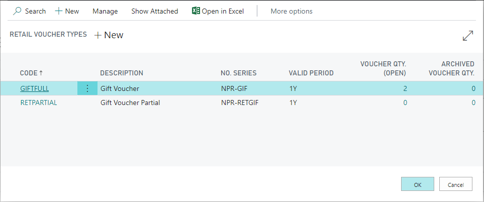

# Create a voucher on a Sales order

A retail voucher is a document that entitles the owner to purchase goods or services with it. As such, it can take the form of paper, electronic vouchers, tokens, and so on. It is widely used in the Retail & Service industries. 

Vouchers can be generated through a sales order. To do so, follow the provided steps: 

1. Click the  button, enter **Sales Orders** and choose the related link. 
2. Click **New**.
3. Populate the following fields on the sales order header:

- **Customer No.**
- **External Document No.**
- **Salesperson Code**

> [!NOTE]
> if some of the fields other than those mentioned above are mandatory, please fill them in. 

2. To generate a voucher, click **Action** in the ribbon, followed by **Retail Voucher**, and finally **Issue Voucher**.

    

    The **RETAIL VOUCHER TYPES** window is displayed as a result.

    

3. Select the appropriate type of voucher (e.g gift voucher) and click **OK**.       
   A notification that the voucher has been created will be displayed. 

    

    Using the function above, the system will create a new line in Sales order for the selected voucher type. 

> [!NOTE]
> If necessary, new sales lines for items and G/L accounts can be added.

4. Enter the voucher amount on the created sales order line in the **Unit Price Excl. VAT** field.

5. In the **Action** section, select **Posting**, and then click **Post**. 

6. Select the **Ship and invoice** option.

7. Click **OK**.       
   The sales order is now posted, and a sales invoice created. 

### Related links

- [Create a new voucher](Create_a_new_voucher.md)
- [Voucher types](../explanation/Voucher_types.md)