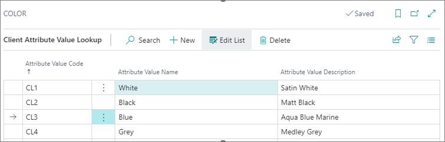

# Set up client attributes

Client attributes are extra fields that can be added to the **Item** and **Members** tables. They can be used for analysis and definition of specific properties associated with items or members. You can define these attributes in their respective **Client Attribute Cards**. 

To create client attributes, follow the provided steps:

1. Click the  button, enter **Client Attributes**, and choose the related link.           
   The administrative section for defining client attributes is displayed.     
2. Define in which table this client attribute is going to be used, and associate the client attribute to a table in the **Lookup Table ID** field.     
   It will then appear on the card that is associated with that table.       
   For example, if we select the table **17 - Items**, the **Client Attributes** will be displayed in the **Extra Fields** section of the **Item Card**.
3. Populate all the necessary [fields](../reference/client_attribute.md).
4. Open the **Client Attribute IDs** section by clicking **Attribute ID** in the **Related** dropdown in the ribbon to define on which tables the attribute will be attached.
5. If you're not using the existing table values, you can define your own set of values to be used in a client attribute. 
6. Define the associated values in **Client Attribute Value Lookup** (reached via the **Related** dropdown in the ribbon) where needed.    
   It's possible to define values if the attribute is either of the **Code** or the **Lookup** type. 

## Next steps

### Client Attribute Value Lookup setup

If you wish to place a value in the **Attribute** field, you can have multiple types of values defined in the **Value Datatype** field in the **Client Attribute Card**.

> [!Note]
> For data type, you can choose between **Text**, **Code**, **Date**, **DateTime**, **Decimal**, **Integer**, and **Boolean**.

When you set the **Datatype** field to **Code**, you can opt for having a list of values to select from or for looking up the list for values. You can choose between two sources: 

- An existing table
- A set of values

If you don't use the values from the existing tables, you can build our own lookup values. It is in the **Client Attribute Card** that you define the values which will be displayed in the lookup on the card. 

| Field     | Description |
| ----------- | ----------- |
| **Attribute Value** | Specifies the ID of the attribute value. |
| **Attribute Value Name** | Specifies the name of the attribute value. |
| **Attribute Value Description** | Specifies the description of the attribute value. |

> [!Note]
> To display the list of values for lookup in the **Item Card**, you need to place your cursor on the field, then press the *?* key on your keyboard, followed by *Enter*. This keyboard action brings up the list of the defined/available values for this **Attribute** field. After that, it will be possible to select the desired value. 

### Related links

- [Client attributes (reference guide)](../reference/client_attribute.md)