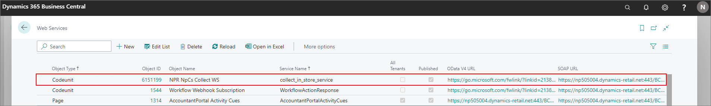

# Set up the Click & Collect module in NP Retail

To set up the Click & Collect module in NP Retail, follow the provided steps:

## Prerequisites

 - Make sure the web service for Click & Collect exists in the company. You can check this in the **Web Services** administrative section.       

 - Make sure there's a user whose **License Type** is set to **External user** in the environment.
   You need to make sure that a password in **Business Central Password Authentication** is set for the user, as well as adequate permissions in the **User Permission Sets** panel of the **User Card**. 
 - The **Role** in the **My Settings** page needs to be set to **NP Retail** so that you can have access to the necessary configurations for the Click & Collect module.

The Click & Collect module configuration consists of the following tasks:

- Create a new **Collect Store**.
- Configure **Collect Workflow Module**.
- Create a new **Collect Workflow**.

## Create a new Collect Store

The following procedure requires necessary steps for creating a collect store that can be successfully used with the Click & Collect module.

1. Click the  button, enter **Collect Stores** and choose the related link.            
   The card contains various options for managing collect stores.  
2. To create a new store card, click **New**.             
   The **Collect Store Card** popup window is displayed. Use the provided fields to create a collect store.       

  > [!Note]
  > The **Code** field is required.

2. Provide the company name in the **Company Name** field.      
   The **Service Url** field is populated automatically according to the value provided in the **Company Name** field.
3. Provide the service username and password in the designated fields. 
4. Activate the **Local Store** toggle switch if you're creating a source collect store, or leave the toggle switch inactive if you're creating a target/collecting store.    
   If this toggle switch is active, the new **POS Relations** section displays in the **Store Card**. This section can be used for defining which POS store/unit the collect store is associated with.          

## Configure Collect Workflow Module

The **Collect Workflow Module** administrative section contains the codes and IDs used in the Click & Collect module for sending and collecting orders. Its default state is presented in the following screenshot, but it can be edited if needed.

## Create a new Collect Workflow

The collect workflows define the behavior/functionality of collect orders which are sent to a given store. To create a new collect workflow, refer to the provided steps:

1. Click the  button, enter **Collect Workflows** and choose the related link.            
   The card contains various options for managing collect workflows.
2. Click **New**.    
   The popup window with options for creating a new workflow is displayed.    
3. Populate the fields.       

> [!Note]
> The **Code** field is mandatory.

4. Use the options in the **Send Order** section to determine whether the store will receive email notifications about the order, define what the email template looks like, how the customers are mapped during the order import in the collecting store, and so on. 
5. Define the options in the **Order Status** section if you wish to notify the customer about each step of the order delivery process, and to define templates for each one of those notifications. 
6. Use the options in the **IC Clearing** section to determine how the intercompany reconciliation is performed across multiple companies when orders/items are transferred, sold, and shipped.