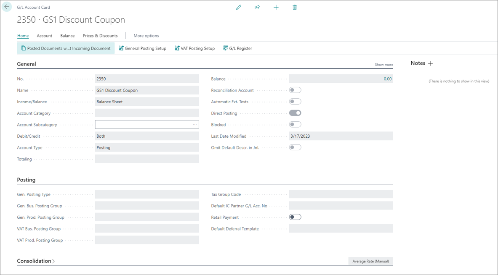
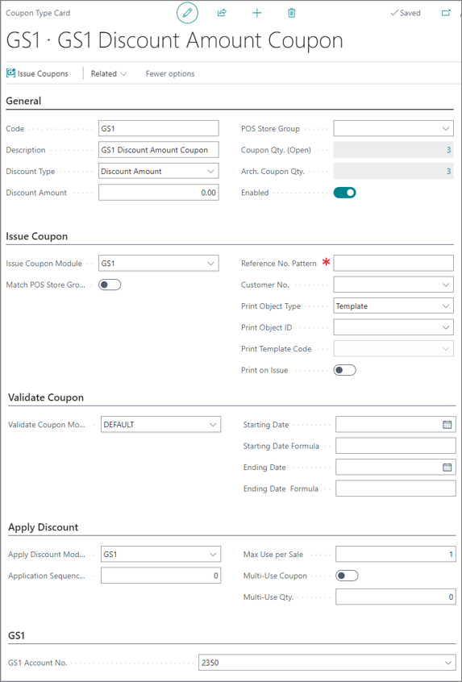
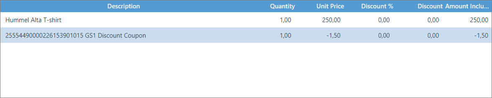

# Create discount coupons with GS1 coding system

The [GS1 system](https://www.gs1us.org/upcs-barcodes-prefixes/additional-ways-to-identify-products/coupons) is widely used in the retail industry and the trade sector. It provides keys which ensure unambiguous identification of goods, services, assets, locations etc. worldwide. These keys are represented by data carriers like barcodes placed on coupons which in turn allow customers to gain certain discounts for purchasing goods.

> [!Note]
> The GS1 system ensures that each coupon number is unique when used within the monetary area of the appropriate GS1 monetary organization.

To create GS1 discount coupons, make sure the prerequisites are met and follow the provided steps:

## Prerequisites

- Create a G/L account for posting GS1 coupon discounts. This G/L account needs to have direct posting enabled.

   

## Procedure

1. Click the  button, enter **Coupon Types** and choose the related link.         
   The list of all existing coupon types is displayed. 
2. Click **New**.      
   The **Coupon Card** pop-up window is displayed.
3. Populate all necessary fields in the **General** section with the following values:
   
   | Field Name      | Suggested Values |
   | ----------- | ----------- |
   | **Code**       | Provide **GS1**.   |
   | **Name**       | Provide **GS1 Discount Amount Coupon**.  |
   | **Discount Type** | Provide **Discount Amount**.  |
   | **Discount Amount** | Leave this field blank, as the amount is determined by the barcode. |
   | **POS Store Group** | Leave this field blank, as there are no restrictions established by the store group, (unless explicitly stated in the store's policy). |
   | **Coupon Qty (Open)** | Leave this field blank, as the value is automatically generated and updated every time the shop accesses the coupon. |
   | **Enabled** | Make sure you enable the coupon to make GS1 type coupons valid in the shop. | 

4. Populate all necessary fields in the **Issue Coupon** section.      
   In this section, only the **Issue Coupon Module** field is updated by the GS 1 module. All other fields in this section aren't configured as they are related to the store's process of issuing coupons. 
5. Populate all necessary fields in the **Validate Coupon** section.       
   In this section, only the **Validate Coupon Module** field is set to **DEFAULT**. None of the other fields are configured as they aren't related to the GS1 barcode. 
6. Populate all necessary fields in the **Apply Coupon** section. 

   | Field Name      | Value |
   | ----------- | ----------- |
   | **Apply Discount Module** | Specify the discount module that will be used - **GS1**. |
   | **Application Sequence No.** | Leave this field blank. The value of the application sequence number isn't used for the GS1 type coupon. |
   | **Max Use per Sale** | Provide **1** as it is the maximum number of coupon uses per a sale. |
   | **Multi-Use Coupon** | Make sure this field is **Disactivated**. 

7. Populate all the necessary fields in the **GS1** section.        
   Specify the GS1 General Ledger Account in the **GS1 Account No.** field. Make sure you've provided the correct name in the account, as it will be displayed as the description on the relevant POS sales line, along with the barcode. E.g. GS1 Discount Coupon.

   

## Next steps

## Scan GS1 coupons on POS

### Prerequisites

- You need to define a button to scan coupons from the POS Sales View on the POS and attach the **SCAN_COUPON** POS action to it. There are no additional parameters that need to be defined.

### Procedure

1. Open the POS. 
2. Scan all the items that the customer wishes to purchase.
3. Click the button you've previously defined, e.g. **Scan Discount Coupon**.       
4. Scan the coupon barcode.
   When the coupon is scanned on the POS, a sales line is inserted with the description and the amount to be deducted on the sale. The coupon entries are then created.      
   > [!Note]
   > The discount is applied as a new G/L line with a negative amount which is calculated from the barcode.         

   

### Related links

- [Coupons](../../coupons/intro.md)