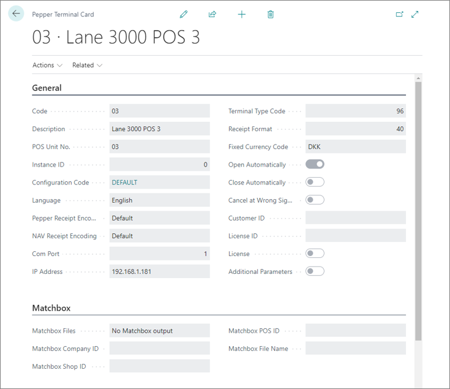

# Set up a Pepper terminal

Pepper terminals need to be set up individually, since the integration works with many different terminal types which have different parameters. 

To set up a new Pepper terminal which uses Lane/3000 terminals through network on **IP 192.168.1.181**, follow the provided steps:

## Prerequisites

- Have the [basic Pepper terminal setup package downloaded](import_pepper_terminal_package.md).
- Have the [Pepper terminal type 96 created](new_terminal_type_setup.md).

## Procedure

1. Click the  button, enter **Pepper Terminal List**, and choose the related link.         
2. Click **New** to open a Pepper Terminal Card.
3. Provide **03** in the **Code** field.       
    The code doesn’t need to be same as the **POS Unit No.**, but it may make keeping track of the terminals easier.
4. Provide **Lane 3000 POS 03** in the **Description**.
5. Provide **03** in **POS Unit No.**
6. In the **IP Address** field, provide **192.168.1.181**.
7. Open the dropdown in the **Terminal Type Code** and select **96**.       
   This is the code of the previously created terminal type.
8. In **Fixed Currency Code** open the dropdown and select **DKK**.
9. Tick the **Open Automatically** and **Close Automatically** checkboxes.         
    **Open Automatically** implies that if the terminal is closed, it will be opened as soon as you send a transaction to it, instead of having to use a specific button to open it. **Close Automatically** means that when the balancing is carried out at the end of the day, it also results in the terminal being closed automatically. 

    

> [!Note]
> Since there is a test license attached to the **Pepper Configuration** in the **Basic Pepper Terminal Setup**, the **Pepper Terminal** will use it if no additional licenses are set up in the specific **Pepper Terminal Card**.

10. Exit the **Pepper Terminal Card** and navigate to the **EFT Setup**.
11. In **Payment Type POS** insert **T**.     
    The **T** is used as a general **POS Payment Method** to make our terminal calls.
12.	In POS **Unit No.**, insert **03**.
13.	In **EFT Integration Type** open the pop-up by clicking , and then select **PEPPER**.
