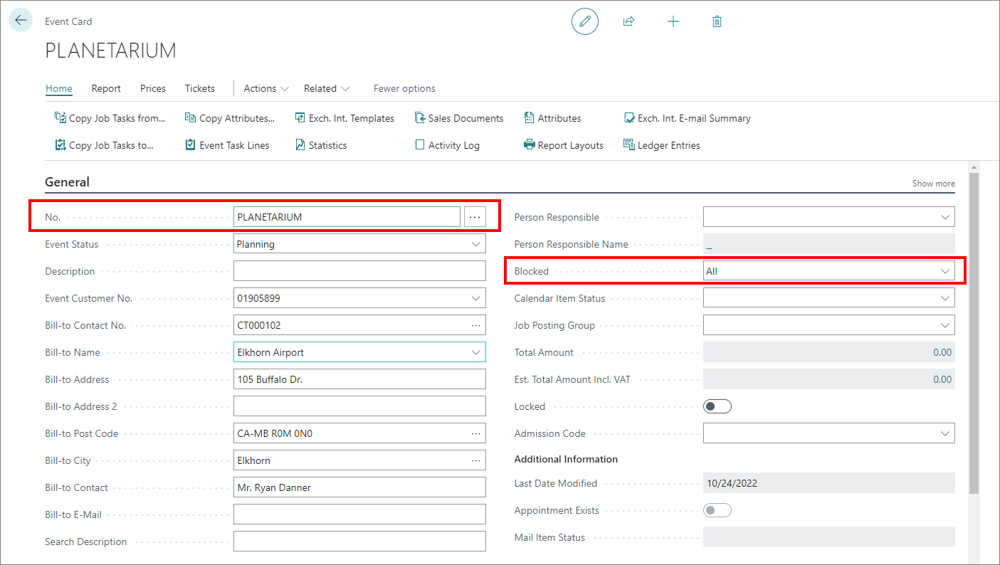

# Set up event templates

Any event can be turned into an event template just like standard jobs can be used as job templates. Once defined, they can be copied and reused as many times as needed, thereby reducing the overhead time on some more trivial activities such as specifying frequently used resources, defining report templates or setting attributes.

To create a new event template, follow the provided steps:

1. Click the  button, enter **Event List**, and choose the related link.           
2. Click **New**.    
   The **Event Card** is displayed. You can provide all the necessary options here to create the configuration you need. 
3. Populate the **No.** field.     
   It's recommended to populate it manually so it's easily understood what the template is used for.   

   > [!Note]
   > You can enable manual entry in the **No. Series** administrative section by ticking the **Manual Nos.** checkbox for the **E-VENT** no. series.

4. Provide the customer in the **Customer No.** field.    
   It's recommended to use the default customer that will only be used for event templates.
5. When you assign the customer to the template, navigate to their **Customer Card** and block them. This ensures that the customer will not be used when creating an event or anywhere else in the system.
6. Set the **Blocked** field (in the **Event Card**) to **All**.     
   This ensures that you won't create a sales invoice or post anything related to this event by mistake.  

    

7. In the **Lines** section, you can set resources/items that are usually referenced alongside this template (e.g. room, tutor, brochures...). 

    > [!Important]
    > Don't specify a date unless you're creating an event for a specific date. The same applies for any specific quantities - if you're creating a template, it should have a broader use than an event, so adding specific data may get in the way of that. 
