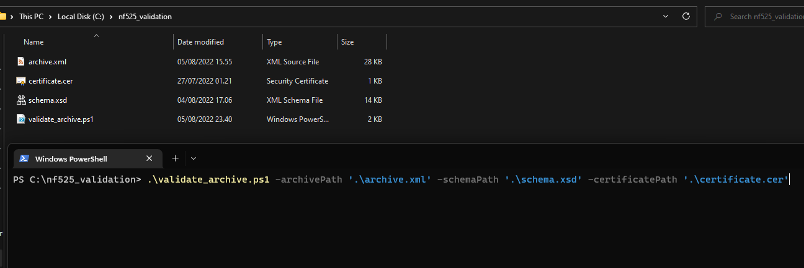

# Data Archives - Fiscalization

This article provides information needed to understand how NP Retail exports to .xml archives, how these .xml archives are secured, and how you can validate that they have not been tampered with.

## Period Archives

The automatic period archiving process is done via the Job Queue module in Business Central. The exported archives are stored in an Azure Blob Storage, inside a customer-specific container, that NaviPartner maintains full control over.
This means that the access to an exported archive of a customer will be provided by reaching out to NaviPartner via the usual communication channels, i.e. the case system, contact e-mail.

The schema file that archives adhere to can be downloaded at 
[Archive Schema](../files/nf525_schema.xsd).

> [!Note]
> You can always manually export a monthly period manually as well by navigating to the **Workshift Summary** page and using the **Archive**..

## Archive Validation

To ensure integrity of exported archives, all .xml archives are signed with the same certificate as all POS event signings.

The XMLDSIG canonicalization method is XML-C14N 1.0, and the signing is done via RSA & SHA256 as all the other POS event signings.
If you reach out to NaviPartner we can supply you with a .cer certificate file that includes the public key of the cert used by a specific customer.
NaviPartner also provides a powershell script that can be downloaded from and executed to validate both the schema of the XML file and the signature validity - 
[Archive Validation Schema](../files/nf525_validate_archive.ps1).

It takes 3 parameters:

- archivePath - The archive to be validated
- schemaPath - The XML schema file to validate it against
- certificatePath - The .cer certificate file.

The easiest way to execute the script is to place all 4 files, meaning the archive, the schema, the certificate and the script in the same folder - after which you can execute the script as indicated in the provided image.



## Archive Structure

The overall structure of the archive is as follows:
```
<Archive>
    <GrandPeriod>
        <ArchiveSignature/>
        <SystemEntryNo/>
        <SequentialID/>
        <FromDate/>
        <ToDate/>
        <GrandTotal/>
        <PerpetualAbsoluteGrandTotal/>
        <PerpetualGrandTotal/>
        <PeriodGrandTotalSignature/>

        <Tickets/>        

        <Duplicates/>        

        <GrandTotals/>        

        <JET/>        
    </GrandPeriod>

    <Signature/>    
</Archive>
```

The first segment is a header for the monthly grand period that is archived, followed by lists of all the events signed in that period.
After the GrandPeriod element there is a Signature element that contains the XML signature for the file, making it tamper-proof. 

See the schema file linked above for an in-depth overview of all XML elements in each of the 4 event type sections (tickets, duplicates, grandtotals, and JET).

## Legacy

Prior to the version 11 of NPRetail, the archive files were not signed and they followed a different schema. The old schema can be downloaded from 
[Old Archive Schema](../files/nf525_schema_old.xsd).

### Related links

- [Data archives (FR)](archive_fr.md)
- [NF 525 compliance](info.md)