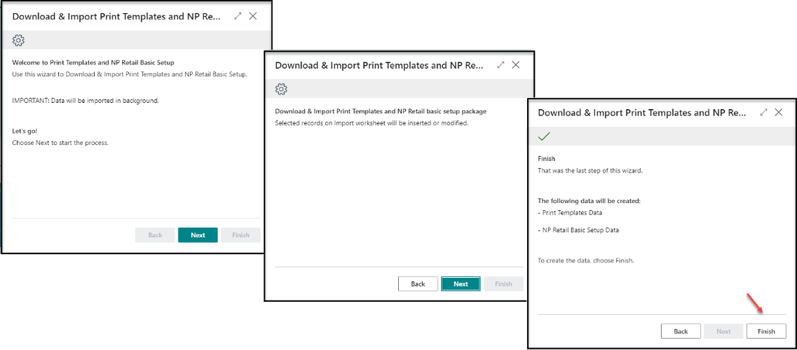
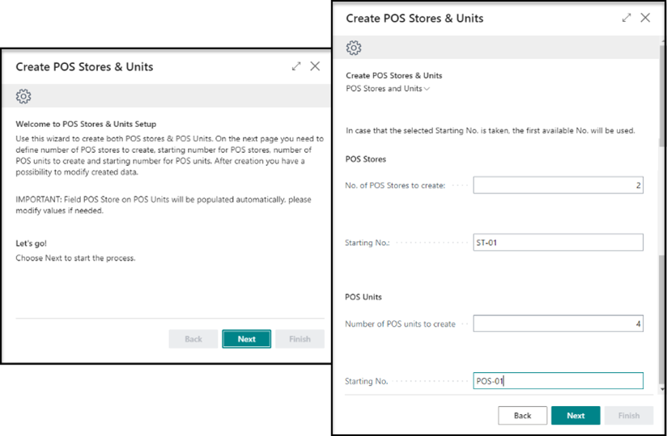
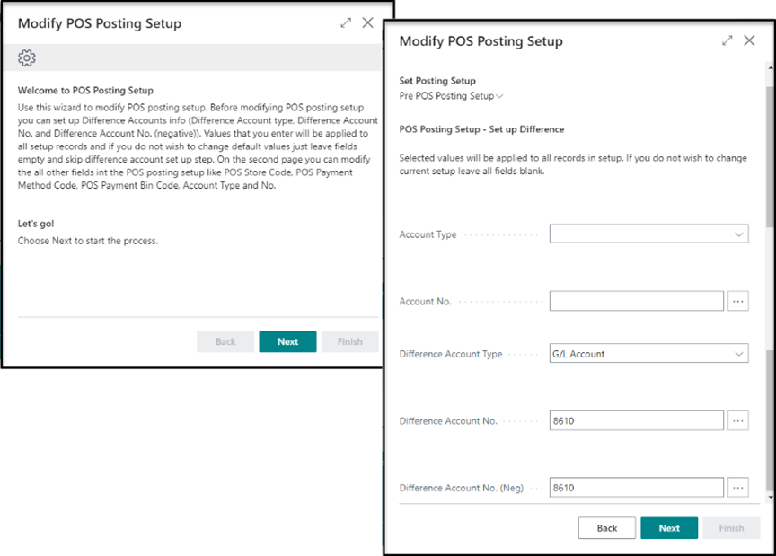
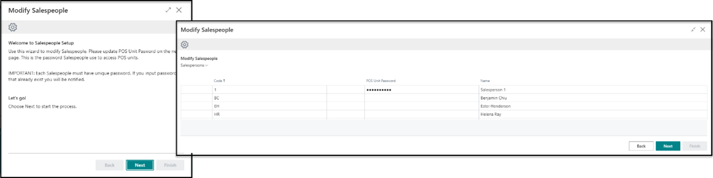

# Getting Started Wizard for NP Retail

The wizard helps users to create the configurations needed to setup the components of NP Retail. The configurations like POS Store, POS Units, POS Profiles, POS Payment Methods and POS Posting Setup. 

To set up the Getting Started Wizard, follow the provided steps:

## Prerequisites

- Complete the basic setup of Business Central (chart of account, posting setup, VAT setup, Sales & Receivables setup, Purchase & Payables setup and, Inventory setup)
- Install the extension for NP Retail. 

## Procedure

1. Log into the NP Retail role center.
2. Click **Get Started** to initiate the setup wizard.       
   The Retail setup checklist is displayed.
3. Click **Start** next to each instructional video, to get all the necessary information for initial setup.
4. Download, edit, and import the **Retail Print Templates**   
   
   

5. Create [POS stores](../posunit/howto/Create_new_POS_store.md) and [POS units](../posunit/howto/createnew.md).     
   
   

   As a result, you are presented with a screen for master data of different POS stores to be created. The information is automatically picked based on your **Company Information** page, and it needs to be modified according to the exact store and POS data. 
6. Modify the [POS Posting Profile](../pos_profiles/howto/POS_Pos_Prof.md), i.e. the general profile for the POS store, such as general posting setup and default accounts used by your POS store.      
   The required fields are: 
   - **General Business Posting Group**
   - **VAT Business Posting Group**
   - **Differences Account**
   - **POS Sales Rounding Account**    

   > [!Note]
   > If some of the accounts haven't yet been created, you can create them on the fly. 

7. Click **Finish**. 
8. Modify the [**POS Payment Methods**](../posunit/howto/POS_payment_methods.md).     
   A sample payment method is automatically created, but you need to modify it or add other payment methods. You also need to check the validity of **Rounding Precision**, **Rounding Type**, and **Rounding Accounts**.     
   - **Rounding Precision** - specifies how precise the applied rounding will be. It represents the lowest denomination used for the selected payment method.
   - **Rounding Type** - specifies which rounding type will be applied to the amount. 
   - **Rounding Accounts** - specifies which G/L accounts will be used for rounding gains and losses.
9. Complete setup by clicking **Finish**.   
   You can always create additional payment methods afterwards. 
10. Modify the [POS Posting Setup](../posunit/explanation/POS_posting_setup.md).   
    These configurations specify how the transactions and the end-of-day balancing will be posted in the general ledger and subledgers. 

    > [!Note]
    > Before modifying the POS posting setup, you need to create the different accounts in the **Chart of Accounts** or **Bank Accounts**.
    
    

    The required fields are:
    - **Difference Account Type**
    - **Difference Account No.**
    - **Difference Account No. (Neg.)**

11. Complete the setup by clicking **Finish**.
12. Create the [salespeople](../posunit/howto/salespeople_setup.md) that are going to log into the POS.    
    Additionally, you will be presented with several examples that already exist in the database, which you can modify or delete. At least one salesperson is necessary to start working in the environment.

    

13. Complete the setup by clicking **Finish**.    
    The POS is ready to be used. a