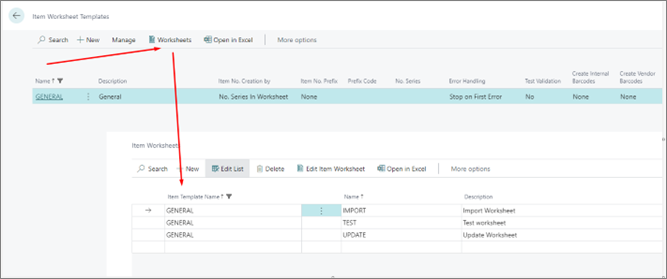

# Item Worksheet

An item worksheet template can have one or more item worksheet records. The item worksheet specifies more options on the import and processing of item worksheet lines. From **Item Worksheet Template** it is possible to navigate to **Item Worksheets** using that template:

In this administrative section, the following options are available for setup:

| Field Name      | Description |
| ----------- | ----------- |
| **Name** | Specifies the name of the worksheet. |
| **Description** | Specifies the description of the worksheet. | 
| **Vendor No.** | If this is a dedicated worksheet for a single vendor, you can enter the vendor number in this field. |
| **Prefix Code** | Used in the item number prefix with the option **Worksheet**. |
| **No. Series** | Specifies the number series used to create new items. |

### Related links

- [Item Worksheet Templates](item_worksheet_template.md)