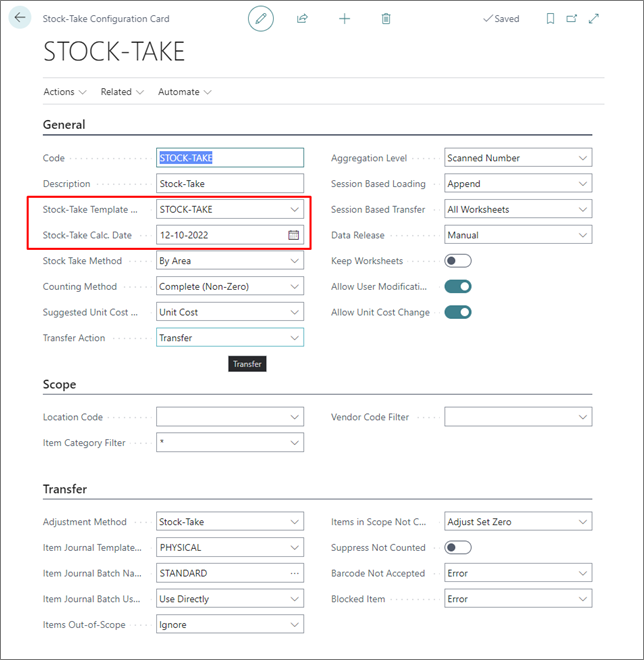

# Configure stock-take

Each stock take requires a specific configuration to describe a particular stock take. All the settings from the template are available. After a template is created, a stock-take configuration may be created using the selected template: 

1. Click the  button, enter **Stock-Take Configurations**, and choose the related link.
2. Click **New**. 
3. Fil in **Code**, **Description**, **Location Code (optional)**, and **Stock-Take Calculation Date** (the date for which the inventory should be calculated - the current stock-count will be based on this date).
4. Populate the **Stock-Take Template Code** to get all settings from the template.     
   If a template doesn't exist, you can [create a new one](item_jour_temp.md) from here. 

    > [!Note]
    > Templates can include the **Location Code**, which may be altered when selecting a template.

    

### Related links

- [Stock-Take Templates (reference guide)](../reference/stock_take_ref.md)
- [Create a stock-take worksheet](stock_take_worksheet.md)