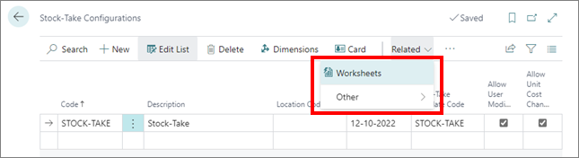
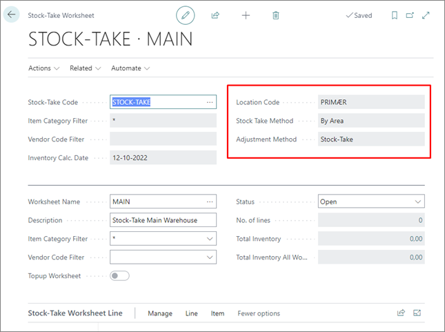
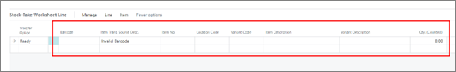
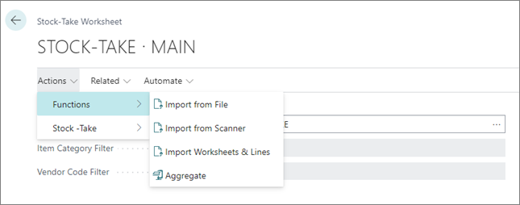

# Create a stock-take worksheet and worksheet lines

To create a stock-take worksheet, and the accompanying worksheet lines, follow the provided steps:

1. Click the  button, enter **Stock-Take Configurations**, and choose the related link.
2. Select the configuration from the list, and click **Worksheets** in the **Related** dropdown list.       
   Worksheets represent logical blocks of work during stock takes. 

    

3. Populate the necessary fields.

    > [!Note]
    > When working with worksheets, it's important to understand how they will interact with one another, and how the counted numbers will be applied. Vital information is displayed in the fields such as **Location Code**, **Stock Take Method**, and **Adjustment Method**. The configuration associated with this stock-take will contain more information about specific properties of the values provided in these fields.

    

4. Either enter the inventory count manually or import from a file. Refer to the following tables for descriptions of the relevant **Stock-Take Worksheet Line** fields:

### Manual entry

| Field Name     | Description |
| ----------- | ----------- |
| **Barcode** | An all-purpose field which supports item numbers and item cross reference barcode numbers. The field will be marked accordingly if the translation fails, or if the item is blocked. | 
| **Item Translation Source Description** | Specifies which table provides the translation for the item number/variant code. | 
| **Blocked** | Indicates whether the item is blocked or not. | 
| **Qty (Counted)** | Specifies how many items have been counted. |
| **Qty (Total Counted)** | Specifies the sum of all equal item numbers/variant codes within the stock-take configuration. |

### Import from file

If this approach is selected, you need to select the import method, and the file which will serve as a source of stock-take data. 

| Import Type  | Description |
| ----------- | ----------- |
| **From File** | Data is imported to the current worksheet. This method follows the NPR standard inventory file format, and the separator is the pipe symbol ("\|"). |
| **From Scanner** | Data conforms to the scanner setup. |
| **Worksheet & Lines** | This approach is similar to the first one, except that a worksheet is also created, if needed. The imported file is CSV. |

> [!Note]
> If lines contain bold entries, that means that there's something wrong with them. If that's the case, you need to correct the issue before proceeding. 

## Next steps

- Once the worksheet has been completed and corrected, you need to [transfer it to the **Item Journal**, and post it](transfer_post_worksheet.md).

### Related links

- [Stock-take by Dimension](../explanation/stock_take_dimension.md)