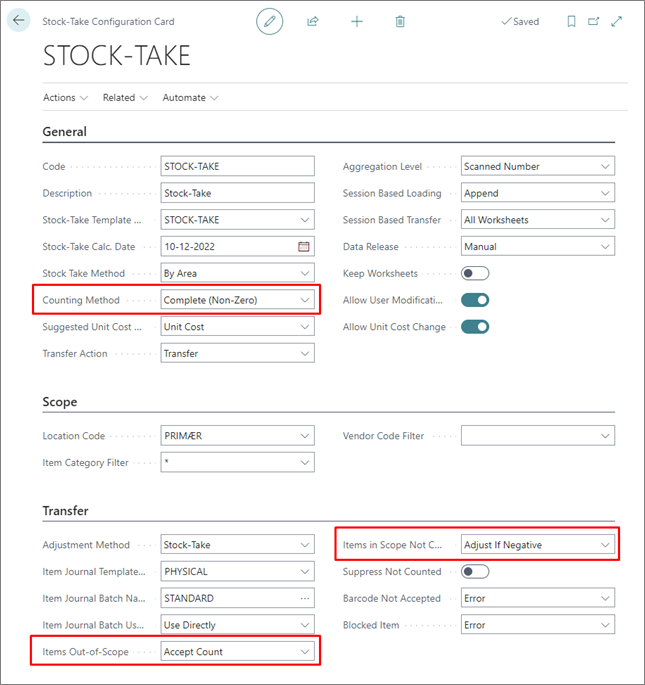
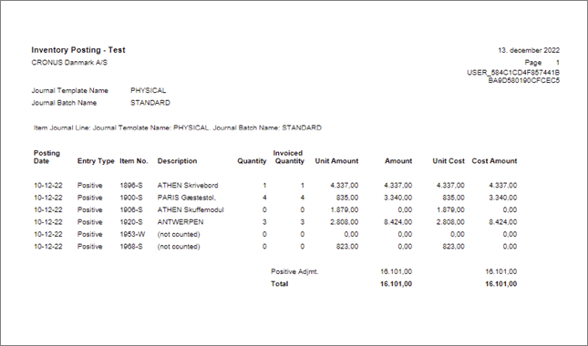

# Transfer and post stock-take worksheet

Once the worksheet has been completed and corrected, you need to transfer it to the **Item Journal**, and post it. 

## Prerequisites

- [Configure the stock-take](configure_stock_take.md)
- [Create an item journal template](item_jour_temp.md)
- [Create a stock-take worksheet](stock_take_worksheet.md)

1. To initiate this process, set the stock-take worksheet's status to **Ready to Transfer** in the relevant **Stock-Take Worksheet** card.
2. Mark all lines, and click **Set Transfer Option to Ready**.   
   
   

3. Click **Calc. Inventory and Transfer** in the **Actions** dropdown.      
   When completed, a confirmation message is displayed. 

 > [!Note]
 > Any errors during the process will result in a complete rollback, and all changes will be reverted.

4. If the **Transfer Action** in the relevant **Stock-Take Configuration Card** is set to **Transfer**, you also need to manually post the inventory journal.   
   In the provided example, certain items weren't counted, as per the applied configuration.

    

5. Accept the current stock level for items that weren't counted. 
6. Adjust the negative stock values to zero.

    > [!Note]
    > In the provided example, **Suppress Not Counted** is false, so the description is modified. 

7. Adjust the items that have been counted. 
8. Navigate to the **Physical Inventory Journals** administrative section, and select the line you wish to post.
9. Click **Actions**, followed by **Post** or **Post and Print**.     
    The standard **Test Report** should be used to document the deviations and the corresponding values.      

    

    If you navigate back to the **Stock-Take Worksheet**, you'll find that the worksheet status has been updated to **Complete**, and that all worksheet lines are set to **Transferred**.