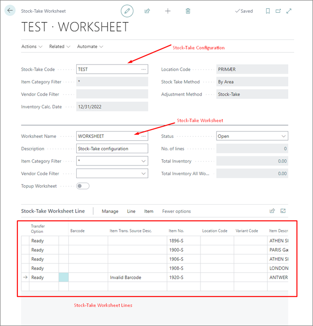

# Stocktaking and physical inventory

Stocktaking is the process of manually recording all inventory that is currently on hand. Before doing a stock-take, you need to create a stock-take worksheet, and configure it. The worksheet's configuration needs to state how the stock-take should be undertaken, and how certain scenarios will be handled. These configurations are kept and maintained in templates that can be reused for different stock-takes. Although a new worksheet requires configuration, templates are optional (although convenient for getting basic settings).

The stock-take module consists of four main entities:

| Entity      | Description |
| ----------- | ----------- |
| [**Stock-Take Worksheet Line**](howto/stock_take_worksheet.md) | The lowest level consisting of barcodes and quantities. This data can be entered manually or by importing files. The worksheet lines are organized in worksheets. |
| [**Stock-Take Worksheet**](howto/stock_take_worksheet.md) | A worksheet provides aid in organizing stock-takes. Worksheets can represent either areas defined by the Business Central location codes (like walls, rows, and shelves) or product groups (from a specific vendor or category). A stock-take needs to have at least one worksheet. |
| [**Stock-Take Configuration**](howto/configure_stock_take.md) | The stock-take configurations set all rules that apply to the stock-take. The rules include inventory calculation date, location code, and settings for handling different scenarios and preferences. A configuration inherits settings from the default stock-take template when created (or a specifically selected one). All settings can be modified on the configuration itself. |
| [**Stock-Take Template**](reference/stock_take_ref.md) | Stock-take templates define the setup that can be reused. The stock-take configuration inherits its settings from a template. |

Once you've configured all listed entities, you need to [transfer and post stock-take worksheet](howto/transfer_post_worksheet.md) to complete the stocktaking process.

