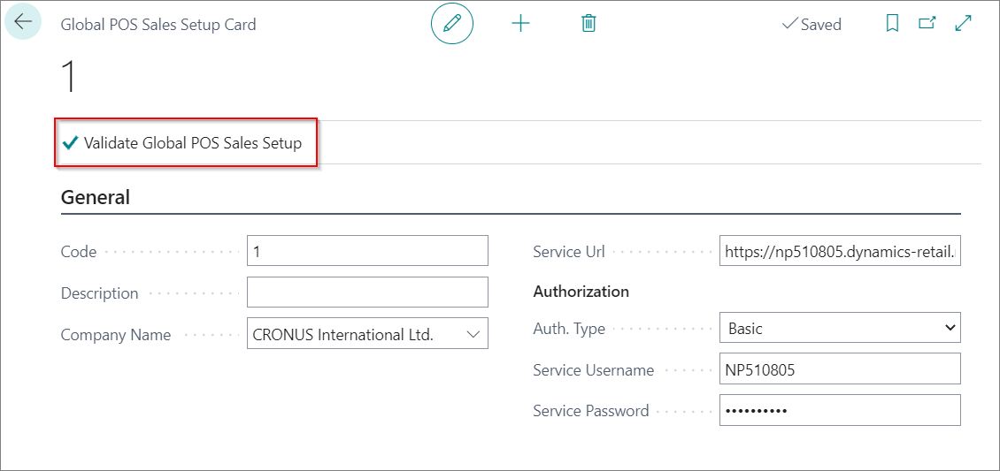
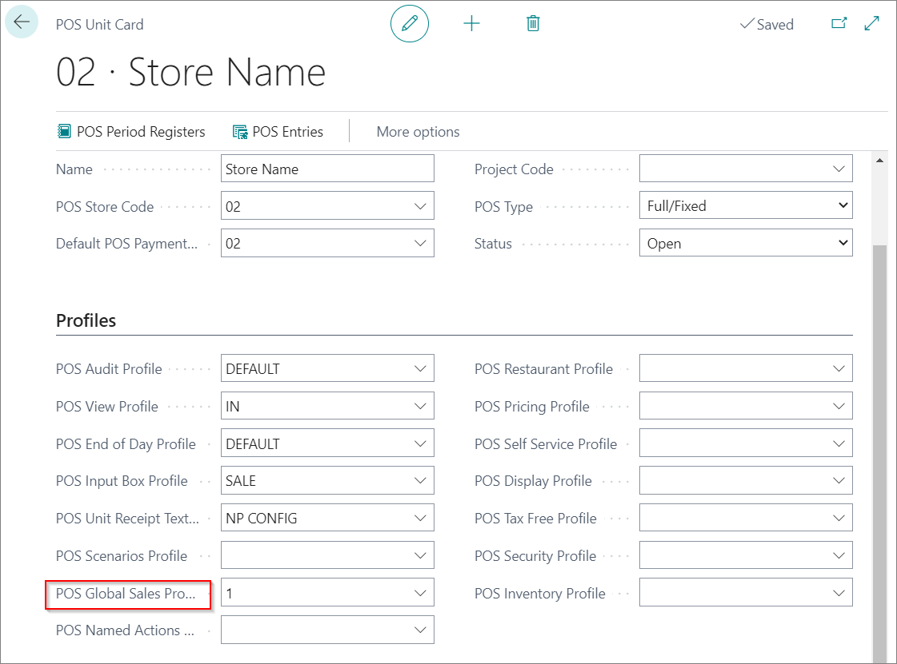

# Set up POS Global Sales Profile

If there are multiple companies, and each one has POS units, there is a way to create one master company in which all POS transactions will be documented. Once this is set up, all companies will send their POS transactions to the master company. To set up the POS Global Sales Profile, follow the provided steps:

1. Click the  button, enter **Global POS Sales Setup** and choose the related link.     
2. Create **New**.
3. Add a **Code**.
4. Add a **Description**.
5. Choose the master company in the **Company name** field.

> [!Note]
> The **Service URL** and **Authorization** fields will be automatically populated.

6. Click **Validate Global POS Sales setup** to complete the setup.

## Next steps

### Set up the global sales  profile on the POS unit

1.  Click the  button, enter **POS Unit List** and choose the related link.
2. Open the **POS Unit Card** of the desired POS unit.
3. Select the prepared POS Global Sales setup in the **POS Global Sales Profile** field.

### Track POS transactions from companies (Global Sales Entries)

There's a way to track all POS transactions from other companies in the master company. 

1. Click the  button, enter **POS Global Sales Entries** and choose the related link.
2. On this page you can see in which POS store, POS unit, and on which date the sales were completed in the POS. You can also see which items were sold in each transaction.

### Related links

- [Set up the POS Named Action Profile](Named_Action_Code.md)
- [POS view profile](../reference/POS_view_profile.md)
- [POS unit Receipt Text Profile](../reference/POS_unit_Receipt_profile.md)