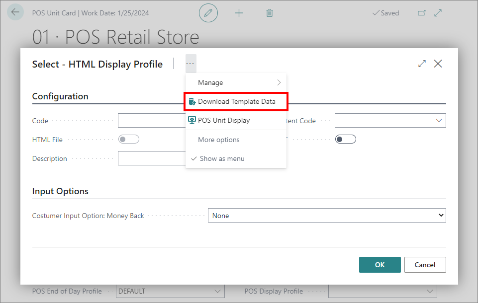

# Set up the POS HTML Display Profile

This guide refers to the newer version of the [POS Display Profile](../reference/POS_Display_profile.md). While it shares the same purpose, such as displaying media content and the receipt view, this profile can do much more, like returning input from the customer display if the touch screen is in use, and the HTML file is equipped to handle the customer's input.
 
There is standard HTML which can be used for the display, which is compatible with the Display Content Lines, which can be added by clicking the action **Download Template Data**

This HTML file can:

- Display the media content defined in the **Display Content Lines**.
- Show the receipt to the customer with prices both including and excluding VAT.
- Collect the phone number and signature.

## Prerequisites

 - Have at least one POS unit configured for sales purposes.
 - Have a dedicated customer display hardware attached to POS units that will inherit this configuration.
    - The [Hardware Connector](../../gettingstarted/hw_connector.md) needs to be installed and run.
    - The POS unit must run in Windows.
 - If input is required from the customer, a touch screen is required.

## Procedure 

1. Click the  button, enter **POS Unit List**, and choose the related link.      
   A list of all existing POS units is displayed. 
2. Click the POS unit you wish to set up the **POS HTML Display** for.   
   The **POS Unit Card** popup window is displayed.
3. In the **Profiles** panel, open the dropdown list next to the **POS HTML Display Profile**, and then click **New**.      
   A new **POS HTML Display Profile** will be opened and ready for input.
4. Fill out the **Code** field.
5. Open the dropdown list next to the **Display Content Code**, and then click the **Select from full list** button.    
6. From the page **Select - Display Content**, click the **Content Line** field on the far right to open the **Display Content Lines** page.   
7. Click **New** to input a URL or to upload an image, video or a HTML file.    
   Add more lines for an image slideshow.
8. Go back to the **POS HTML Display Profile**, and either use the **Download Template Data** action to use a standard HTML or **Upload HTML** action under **Actions** to use a specialized HTML.    
   The HTML file toggle is enabled.
9. Once the POS HTML Display Profile is defined, you can set it on the POS unit of your choice by adding the predefined POS HTML Display Profile in the **POS HTML Display Profile** field.
10. Start or restart the POS unit.   
   The customer display should now display the specified screen.

> [!NOTE]
> If the customer display is displayed on the wrong screen, go to [**POS Unit Display**](../../posunit/reference/POS_Unit_Display.md), and update the information. The numbers displayed on the screens in Windows settings under **System > Display** don't correlate to the number specified in **POS Unit Display**

> [!Video https://share.synthesia.io/48a111db-645a-4ab4-85b6-4551b787b45f]

## Next steps

### Configure refund scenario

To collect input when a sale is finalized and the total amount is negative (i.e. the customer has received a refund) you need to set the field **Customer Input Option: Money Back** to **Phone & Signature**.

When this option is selected, the customer will be presented with the digital input for their phone number and signature on the customer display, and when they press the **Submit** button, the information will sent back to the sales screen, where the cashier can verify the provided information. 

The cashier has three option here:

- Hit the red button to reattempt the input, so the customer gets the possibility to try again. This could be relevant if the signature is declined or the phone number was incorrect. 
- Hit the green button to verify and accept the provided input.
- Hit the Cancel/Close button in the top to cancel the input collection, which implies that no data will be stored, and input will not be reattempted. 

### Related links

- [Create a new POS unit (by using the existing one for reference)](../../posunit/howto/createnew.md)   
- [Configure an opening mechanism for a POS unit cash drawer](../../posunit/howto/ConfigureCashDrawerOpening.md)
- [POS menu](../../posunit/explanation/POS_menu.md)