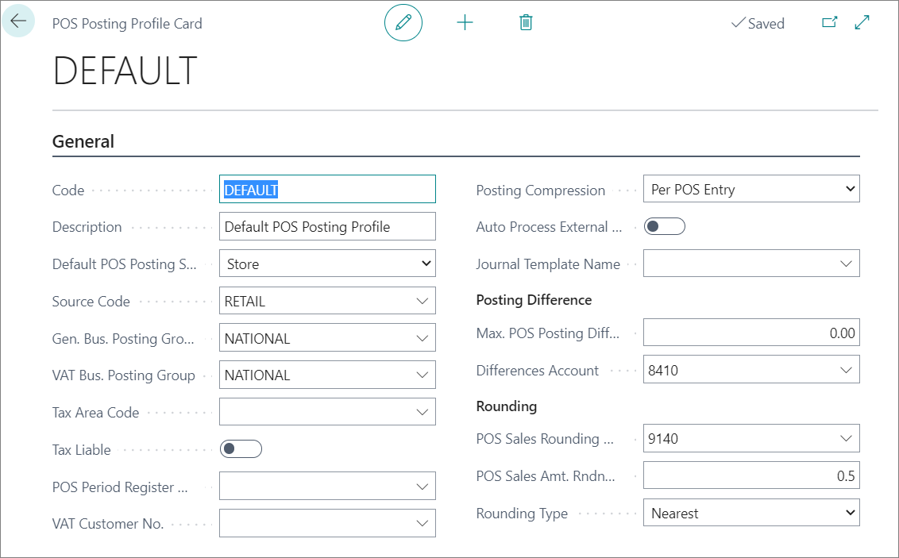
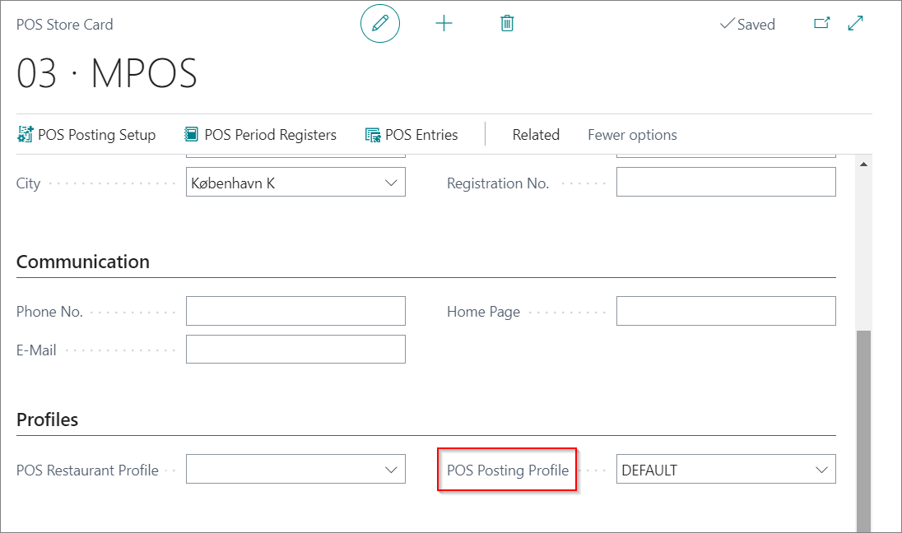

# Set up POS Posting Profile

Each POS unit can have a different set of posting rules. The first thing is to set POS Posting Profile.

1. Click the  button, enter **POS Posting Profile**, and choose the related link.
2. Create **New**.
3. Add the **Code** in the indicated field.
4. Add a **Description**.
5. Make a selection between **Store** and **Customer** in the **Default POS Posting Setup** field.   
   Your choice determines whether rules will apply to the POS store or customers.
6. Set the value of the **Source Code** field to **Retail**.
7. Set the predefined posting group in the field **General Business Posting Group**. 
8. Set the predefined VAT posting group in the **VAT Business Posting Group** field.

> [!NOTE]
> - The **Tax Area Code** and **Tax Liable** fields are only relevant for the US localization.
> - The **POS period Register No. Series** is defined only if the posting to the General Ledger is done by posting the period compression.
> - The **VAT Customer No.** is used if a customer is assigned to the POS store. 

9. Define how the POS entries will be posted in **Posting Compression**.   
   - **Uncompressed** – Every POS entry line is posted as-is in the General Ledger. 
   - **Per POS Entry** – The lines are compressed per an account code within that entry.        
      *Example:* If there are 3 lines for sale with the same revenue account, the entry is compressed into one line in the General Ledger entry for that transaction. 
   - **Per POS Period** – All transactions within that POS period are compressed per the same General Ledger account.       
      *Example:* 100 sales lines are compressed as 1 line in the General Ledger.

10. Specify the value of the **Journal Template Name**, which will be assigned to **General Journal Lines** in the POS Posting activity.
11. Use the **Max POS Posting Differences** field to define the maximum allowed difference caused by the difference between currencies.
12. Define the G/L account on which these differences will be posted in **Difference Account**.
13. Use the **POS Sales Rounding Account** field to define the G/L account in which all sales rounding amounts will be posted.
14. Define on which decimal spaces the rounding will be performed in the **POS Sales Amount Rounding** field.
15. Define how the rounding will be performed in **Rounding Type**.    
    The possible settings are **Nearest**, **Up** or **Down**.

## Next steps

### Add the POS Posting Profile to the POS Store

1. Click the  button, enter **POS Store List** and choose the related link.
2. Select the POS store to which you want to link the prepared POS Posting Profile.
3. Add the prepared POS Posting Profile to the **POS Posting Profile** field.

 

### Related links

- [Balance the POS (Z-report)](../../posunit/howto/balance_the_pos.md)
- [POS Display Profile](../reference/POS_Display_profile.md)
- [POS Unit Receipt Profile](../reference/POS_unit_Receipt_profile.md)
- [POS View Profile](../reference/POS_view_profile.md)
- [POS Audit Profile](../reference/POS_audit_profile.md)
- [POS End-of-Day Profile](../reference/POS_End_of_Day_Profile.md)
- [Set up the POS Global Sales Profile](POS_Global.md)
- [Set up POS Pricing Profile](POS_Pricing_profile.md)
