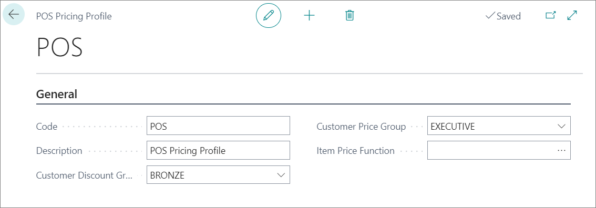
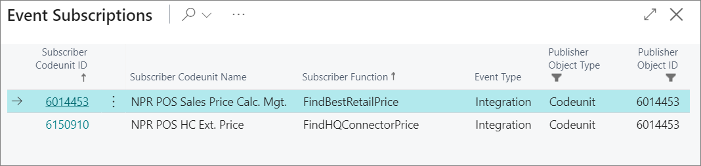
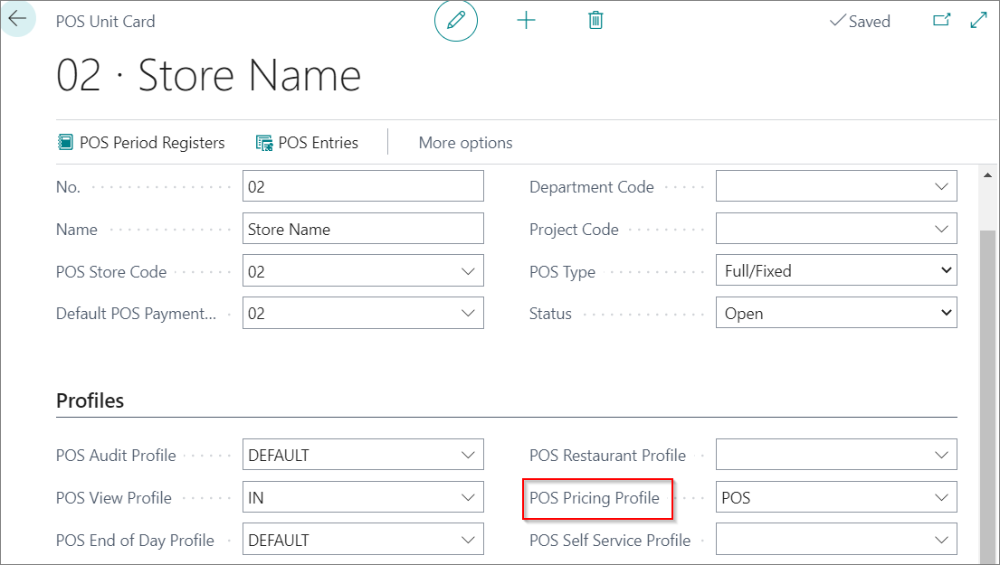

# Set up POS Pricing Profile

Each POS can have different customer price lists, customer discount list, and price matching. To set up POS pricing profiles, follow the provided steps:

1. Click the  button, enter **POS Pricing Profiles** and choose the related link.
2. Create **New**.
3. Type in the name of POS Pricing Profile in the field **Code**.
4. Add a **Description**.
5. In the **Customer Pricing Group** field select the corresponding value of the customer pricing group.
6. In the **Customer Discount Group** field select the corresponding value of the customer discount group.

7. In the field **Item Price Function** choose between:     
   - **Find Best Retail Price function**,   
   - **Find HQ Connector Price**.

 

## Setting POS Pricing Profile on POS Unit

The created POS pricing profile needs to be set on a POS unit for the settings to be applied:

1. Click the  button, enter **POS Unit List**, and choose the related link.
2. Open the **POS Unit Card**
3. Add the created profile in the **POS Pricing Profile** field.

### Related links

- [Balance the POS (Z-report)](../../posunit/howto/balance_the_pos.md)
- [POS Display Profile](../reference/POS_Display_profile.md)
- [POS Unit Receipt Profile](../reference/POS_unit_Receipt_profile.md)
- [POS View Profile](../reference/POS_view_profile.md)
- [POS Audit Profile](../reference/POS_audit_profile.md)
- [POS End-of-Day Profile](../reference/POS_End_of_Day_Profile.md)
- [Set up the POS Global Sales Profile](POS_Global.md)
- [Set up POS Posting Profile](POS_Pos_Prof.md)