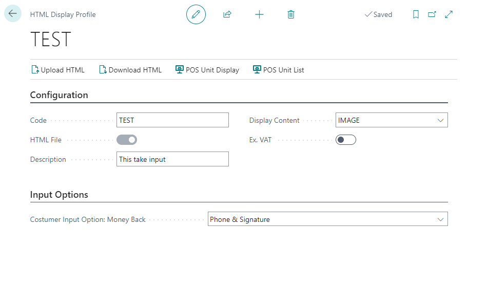
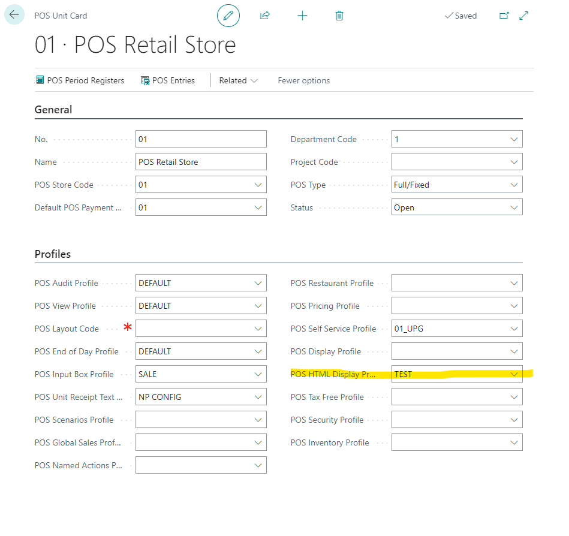

# POS HTML Display Profile (reference guide)

Each POS unit can have a different display view. The following fields can be set up in each **POS HTML Display Profile**:

| Field Name      | Description |
| ----------- | ----------- |
| **Code**       | Specifies the unique code of the profile.     |
| **Description**   | Specifies the short description of a profile.        |
| **HTML File**  |  This field shows if there is an uploaded HTML file, which is sent to the Hardware Connector. |
| **Price ex. VAT** | Specifies whether the prices are visible without the VAT on the POS. |
| **Display Content Code** | Specifies the **Display Content Code** group that will be used for this POS HTML Display Profile. Display Content Codes are groupings of either images, videos, or URLs. This is where the media displayed on the customer display is uploaded or linked to. |
| **Costumer Input Option: Money Back** | Specifies the input method for ending a sale with a negative total i.e. returning money to the costumer. It can be **None** or **Phone & Signature**. |

Once the POS HTML Display Profile is defined, you can set it on the POS unit of your choice by adding the predefined POS HTML Display Profile in the **POS HTML Display Profile** field.

