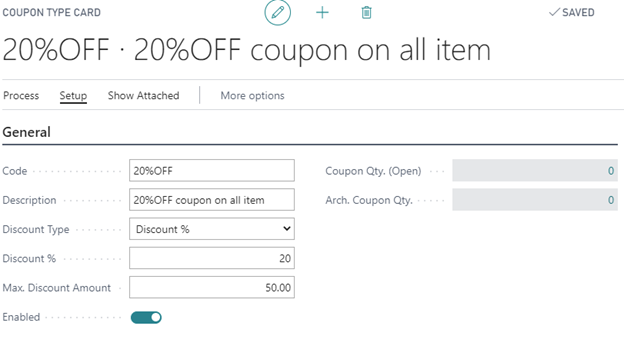

# Loyalty setup

Loyalty function is created on top of Membership module, so first steps for creating new Loyalty program would be: 

1. Creating member community,
2. Creating Membership setup,
3. Creating Membership Sale setup.

Creating of these setups are already explained in NP Membership Starter, so here we will just emphasize setups which are specially used for Loyalty program.

As Loyalty setup is created on top of Membership module, it must be activated for special member community. From that reason, in **Member community** page there is field **Activate Loyalty Program**. When this field is checked, all members that are in this member community will benefit from loyalty program.

In **Membership setup** card in tab **CRM & Loyalty** should be assigned **Loyalty Code** for members from this membership to be able to use Loyalty program. As it is possible to create different loyalty programs, different memberships can have different benefits and different conditions for accumulation of points. Because of this reason it is important to assign appropriate Loyalty code in every membership. Creating Loyalty Code will be discussed later.

To be able to assign points on sale of membership (in moment of creating new members) in **Membership Sale Setup** it should be checked field **Assign Loyalty points on sale**. In this way customer can be awarded immediately because he decided to be loyal to a company.

As it was said above for members to be able to use Loyalty program, on their membership setup card should be assigned **Loyalty code** which is created in **Loyalty setup** page.

We can imagine that **Loyalty code** is type of Loyalty program which has its own setups. Based on these setups, Loyalty programs can be different in many ways. They can have different benefits for customers, different collecting period, different expiration period, but also different conditions for accumulation of points.

As for collection period there are two options: 
1. **As you go** meaning that member will be able to collect points from the moment of becoming member
2. **Fixed** meaning that member will be able to collect points in fixed period which is defined by fields “Fixed Period Start” and “Collecting Period Length”.

If there is need to setup some Loyalty program with points that have expiration period, **Expire uncollected points** should be checked and in **Expire uncollected after** filed should be set period after which points should expire.

Different conditions for accumulation of points can be regulated with setting up next fields:

- **Point base** – choice that can be made is to use **Amount**, **Item Point setup**, **Amount and Item point setup**. 

If **Amount** is set up, then ratio between amount spent and points awarded will be taken from **Loyalty setup** page and field **Amount factor** and this setup will be used for all items member has bought. 

If **Item Point setup** is chosen in that case setup from page **Loyalty Item points setup** will be taken instead of setup from **Loyalty setup** page. In this **Item Point setup** page it can be defined how many points or value will get customer for buying some special item, or item from some item group set up in this page. Also, some items can be excluded from Loyalty program if we set it up here and assign it **Exclude** in **Constraint** field. 

For example, in above picture if customer buys item 73036 which belongs to Item group 402 it will not get any points because it is excluded. But if buys any other item from group 402 it will get 200 points.

In the end, it is possible to setup **Amount and Item points setu** which means that for items setup in **Item points setup** page, setup from that page will be used, and for the rest it will be used setup from **Loyalty setup** page.

- **Amount factor** defines how many points we will get for 1 EUR spent.
- **Amount base** defines will points be calculated on amount with or amount without VAT.
- **Points on discounted sales** field allows user to disable usage of Loyalty program on sales which has some discounts.

Different benefits Loyalty programs can have by setting up **Points to Amount setup**.

All benefits which member gets being loyal to the company are summed up in coupon which is created from points customer has in his account. Which amount of money customer will get depends on **Point rate** which determines how much money customer gets for 1 point accumulated. In **Points Threshold** it can be set amount of points customer must have so he can benefit from loyalty program. In above picture, customer must have 100 points to be able to get 1EUR for every point accumulated.

Instead of amount of money, customer can get discount % when accumulate enough points. It is necessary **Value assignment** to be set as **Coupon Setup** so after customer accumulate necessary points (points set up in Points threshold) it will get benefits setup on coupon assigned. In example from picture below, after customer gets 500 points, he will be able to use coupon with name “20%OFF” and enjoy benefits that coupon has. 

As **Value Assignment** is set up as **coupon setup**, benefits from loyalty program depends on setup of coupon assigned to this program. So, in our example, customer will have 20% discount and maximum discount amount can be 50 EUR.

### Related links:
