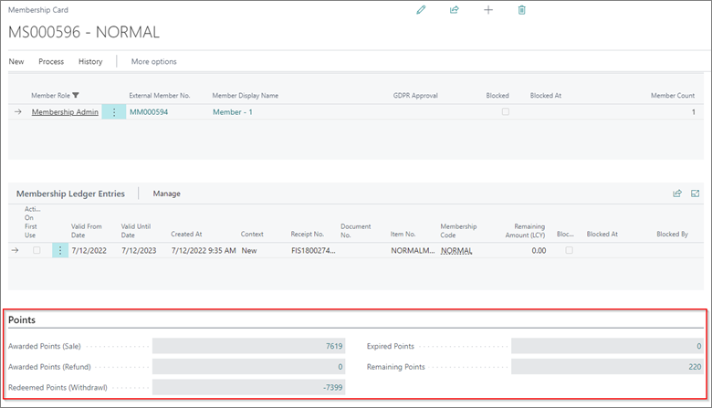

# Navigation and reports

## Navigation

All points for customer can be followed from Membership card. In membership card there is tab **Points**. In this tab are shown Awarded points (sale and refund), Redeemed points, Expired points and Remaining points:

If there is need for more details, all this fields are flow fields and with drop it is possible to see all Membership point entries from which these points are created. For example, if we drop in **Awarded Points (Sales)** – 7619, we will see next entries:

## Reports

For tracking of points there are three reports created in NP retail:

1.	**Membership Points Summary** – This report should be used to show points by membership / customer no. In this report it can be seen awarded, redeemed, expired and remaining points:

2.	**Membership Points Value** – This report should be used for checking value of points available per customer / membership no. 

3.	**Membership Points Detail** – should be used if there is need to be shown all points movement per member.

