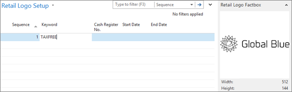

# Set up Global Blue tax free

The Global Blue tax free setup is performed in several sections of Business Central. Follow the provided steps to set it up.

1. Click the  button, enter **POS Tax Free Profiles** and select the related link.               
   The page which contains all POS tax free profiles created in the environment is displayed. Here, you can link the tax free parameters to each available POS unit.
2. Click **New** and define all necessary options.   
   The **Code** field is mandatory. 
3. In the **Handler ID** field, select the **GLOBALBLUE_I2** for the Global Blue integrated solution.
4. Choose between **PROD** or **TEST** to determine whether the integration will be established on the production environment, or not.         
   The **PROD** option should be selected for customers. 
5. Click **Set Parameters** to set up the handler.        
   A popup window containing parameters for handler setup is displayed.
6. Set up everything in the **Required** panel according to the Global Blue instructions for the specific customer.       
   Set up other parameters in the **Dialog** panel if needed.
7. Click the  button, enter **Object Output Selection** and select the related link.
   The window from which the NP Retail print setup can be controlled is displayed.       

   >[!Note]
   >Tax-free vouchers can be printed out either as thermal or PDF, depending on the customer choice and coordination between them and Global Blue. For thermal vouchers, the **Output Path** field should direct to a thermal printer, and for PDF a regular printer needs to be specified. The alternative for normal windows-connected PDF printer is to print the voucher via the [Google Cloud Print](https://www.google.com/cloudprint/learn/).
          
8. Click the  button, enter **Retail Logo Setup** and select the related link.    
   A window in which logos can be uploaded and set up is displayed.   
9. To make sure the Global Blue logo is printed out on the thermal tax-free vouchers, upload it in the **Retail Logo Setup** page with the keyword **TAXFREE**.          
           

### Next steps

- Move on to the [NAS setup](../explanation/nas-setup.md) and the [POS setup](../../../../public/404.md)

