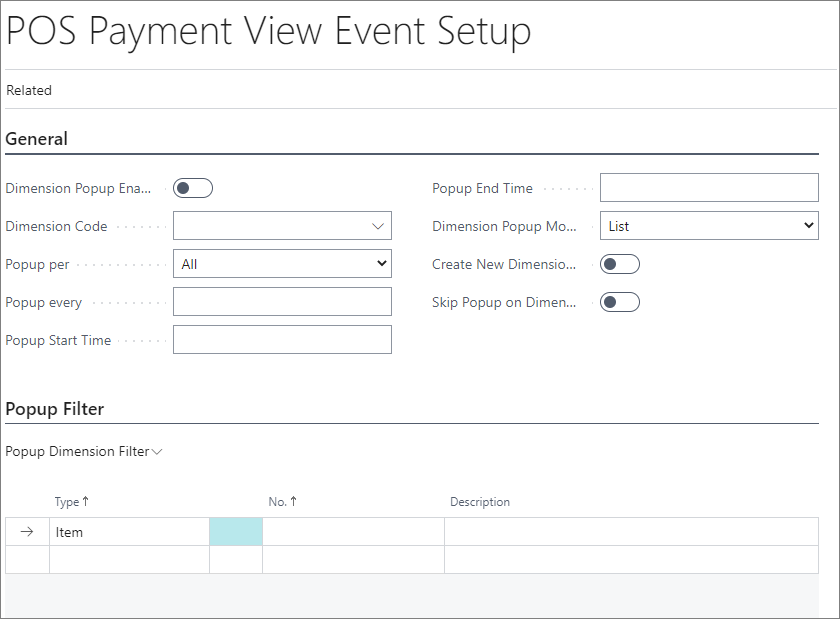
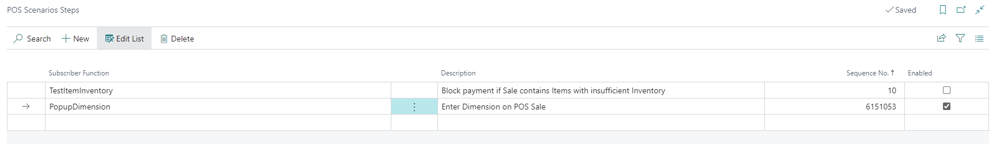

# POS Payment View Event Setup

**POS Payment View Event Setup** can be used so users can be able to enter some dimension in POS transaction. So for example, it can be set up to enter postal code in every transaction in order to analyze transactions based on this information.

In **POS Payment View Event Setup** user defines how often dimension popup should appear in POS transactions. 

To setup criteria on which Dimension Popup will apeare, go to **POS Payment View Event Setup**. Page that will be opened contains two tabs:

In tab **General** should be defined which dimension and how often will apeare in POS transactions:

- **Dimension Popup Enabled** - If this field is checked popup window will apeare in moment when view is changed from sales to payment in POS unit.
- **Dimension Code** - here should be assigned which dimension will popup in POS.
- **Popup per** - Popup can be selected by: **POS Store**, **POS unit**, **All**.
- **Popup every** - Here is defined after how many sales the popup recur.
- **Popup Start time** -The starting time for the popup.
- **Popup End time** - The ending time for popup.
- **Dimension Popup Mode** - This field defines how will look popup window. Options available are: **List**, **Input**, **Numpad**.
- **Create New Dimension Values** - If this field is checked, new dimension will be created if it does not exist in dimension values list when the user input the value in the dimension popup.

In tab **Popup Dimension Filter** it can be setup **Item** or **Item category** which needs to be in sales lines so popup appear in POS.

So that this funcionality can be used in POS transactions, in **POS scenarios** for **PAYMENT_VIEW**, field **Popup Dimension** should be checked:

