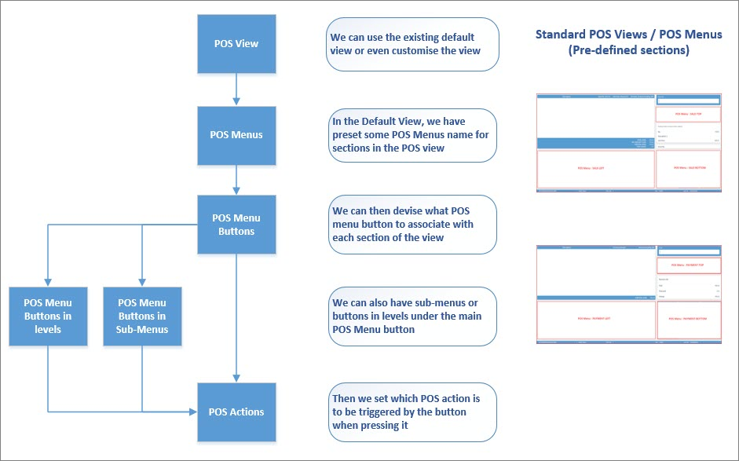
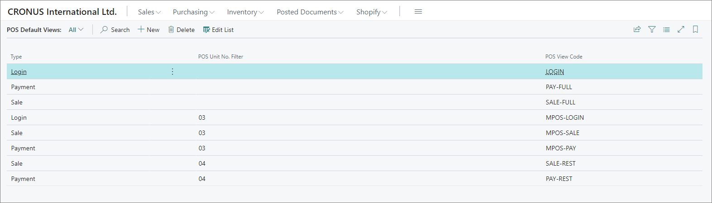
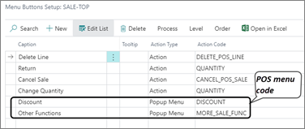
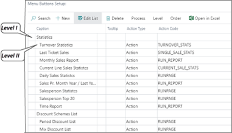

# POS layout, sections and contents

## POS views

The POS view is the layout of the POS screens. Currently, we have a standard layout that is ready to be used by any operation. We can also customize it for specific needs of a particular business. Our layouts are divided into two main sections: 

- POS Sales View - mainly used for listing the items that are added to the cart.

- POS Payment View - its main purpose is to check out customers and accept one of the payment types.

### POS default views

In the **POS Default Views** administrative section you can configure which POS views are used by default on all or on some of the available POS units.

You can map **Login**, **Payment**, **Sale**, **Balance**, **Locked**, and **Restaurant** POS view types to specific **POS View Codes**, in order to make a personalized POS view selected by default for specified POS units. 

## POS menu

POS menus are used for defining the interface used in the POS login view, sales view, and payment view. All menus can be divided into main menus and supporting menus.  

The main menus are displayed in the POS view and those are:

### Login View

### Sales View

This menu usually consists of buttons created for printing and switching from one POS unit to another. 

- SALE-LEFT
- SALE-TOP
- SALE-BOTTOM

Sale menus are used for adding buttons which will allow users to create, modify and delete sales lines, create sales documents, and print documents.

### Payment View

Payment menus contain buttons which allow users to create, modify and delete payment lines. Additional [buttons](../howto/add_button_to_pos_menu.md) can be added.

- PAYMENT-LEFT
- PAYMENT-TOP
- PAYMENT-BOTTOM

It's also possible to create support menus (popup menus).

All menus are created in the **POS Menus** page in Business Central.
This page contains the list of all created menus. Menus can be defined for all POS units or for specific ones, in which case it is necessary to provide the **POS Unit No.** of that specific POS unit. It is also possible to provide access for certain menus to specific salespeople only, in which case the **Salesperson code** needs to be provided as well.  

## POS menus as submenus

It's possible to create a POS menu, and use it as a submenu in a POS button. In that scenario, you can set the **Action Type** to **Popup Menu**, and the **Action Code** to the menu you've created. 

## POS menus with different levels

Inside a POS menu, you can set different levels for the buttons. The first level will be the main one, and all others will be placed lower than it in hierarchy. 

In this example, you will initially only see the button for **Statistics**, but once you click it, the next level is displayed.

### Related links

- [Create a new button in the POS menu](../howto/add_button_to_pos_menu.md)
- [SQL statements for Lookup POS action](../reference/sql_pos_action_filter.md)
- [Create POS menu filters](../howto/create_pos_menu_filter.md)