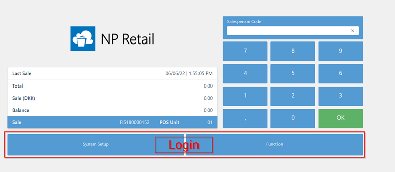
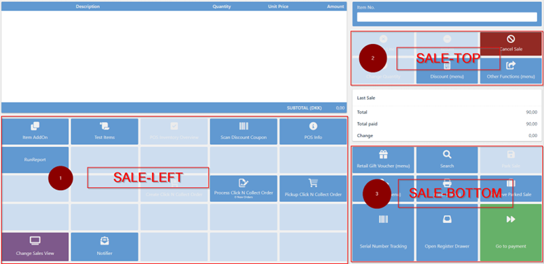
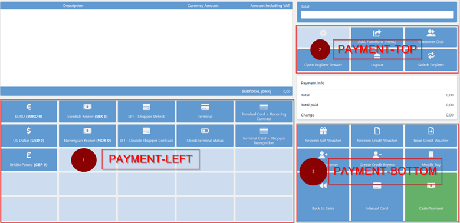

# POS menu

POS menus are used for defining buttons used in the POS.
All menus can be divided into main menus and supporting menus.
Main menus are used in the POS view and those are:

1. LOGIN

This menu is shown in the login view. It usually consists of buttons created for printing and switching from one POS unit to another. 

- SALE-LEFT
- SALE-TOP
- SALE-BOTTOM

Sale menus are used for adding buttons which will allow users to create, modify and delete sales lines, create sales documents, and print documents.

- PAYMENT-LEFT
- PAYMENT-TOP
- PAYMENT-BOTTOM

Payment menus are used for adding buttons which allow users to create, modify and delete payment lines.

It's also possible to create support menus. They are used as popup menus.

All menus are created in **POS Menu** page in Business Central.
This page contains the list of all created menus. Menus can be defined for all POS units or for specific ones, in which case it is necessary to provide the **POS Unit No.** of that specific POS unit.    
It is also possible to provide access to some menus to specific salespeople only, in which case the **Salesperson code** needs to be provided.  

### Related links

- [POS unit](POSUnit.md)
- [Create a new button in the POS menu](../howto/add_button_to_pos_menu.md)