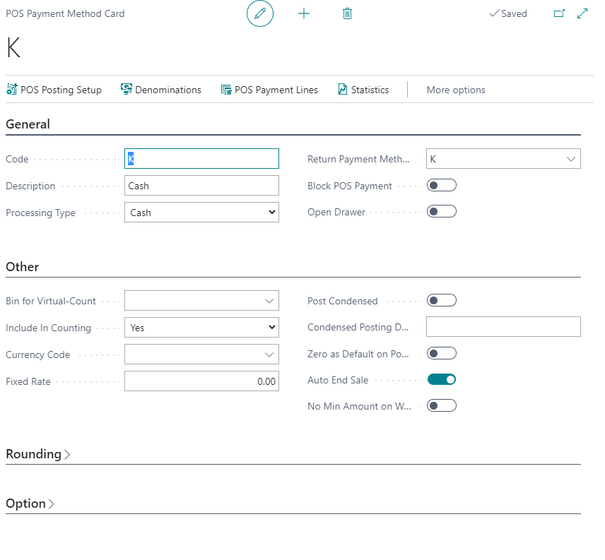

# POS Payment Method List

**POS Payment Method List** is list of all Payment methods created for POS. All of payment methods from this list can be used for creating payment lines in POS unit. After Payment methods are created in this list, they are used in POS menu on buttons. So when payment method is created and set up in button, it can be used in POS for payments.

All of these payment methods has its own card where all setups for methods are. To see all setups for some payment method go to **Manage** and chose **View**. Payment method card will be opened.

### Related links

- 