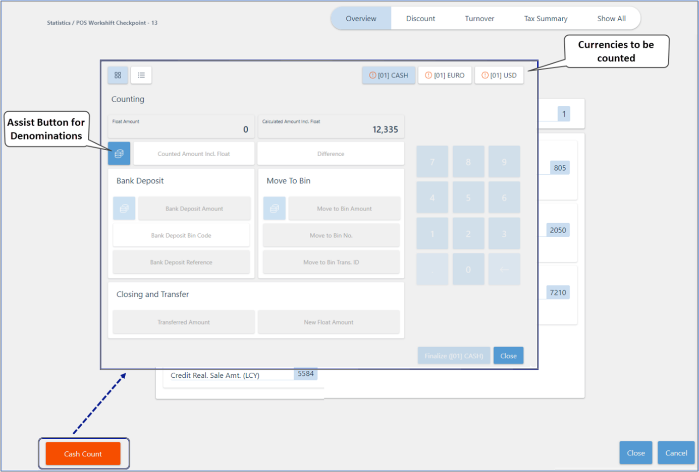

# End-of-day report (POS balance)

The POS balance report, or the end-of-day report, contains the payments received throughout the day on the selected POS unit, and is used for cash count and balancing.

> [!Note]
> You can define the payment bins like bank or safe, and then a common payment bin, where on posting the cash balance, we transfer them out of the default bin.

## Statistics

The **Statistics** screen consists of the following segments:

- **Tax summary**.

- **Overview** of daily sales on the POS unit, cash movements, vouchers both issued and received, credit sales, and other details.

- Overview of all applied **Discounts** during the work shift.

- **Turnover** report and a graphical representation of various turnover stats.

## Counting

The **Counting** screen is displayed when you click **Cash Count** on the POS. In the top-right corner, you can see which currencies have been received in the POS, that require counting and balancing of the POS unit. 

> [!Note]
> If the button is marked in red, the currency hasn't yet been counted. After the count is completed, there will be a green tick next to it. 

> [!Tip]
> For more information about individual fields and options on the **Counting** screen, refer to the [reference guide](../reference/counting_reference.md).

### Related links

- [POS End-of-Day profile](../../pos_profiles/reference/POS_End_of_Day_Profile.md)
- [Configure the POS balancing feature](../howto/balance_pos_v4.md)
- [Configure the POS balancing feature](../howto/balance_pos_v4.md)
- [Balance the POS (Z-report)](../howto/balance_the_pos.md)
- [Generate the end-of-day report on the POS](../howto/balance_the_pos.md)