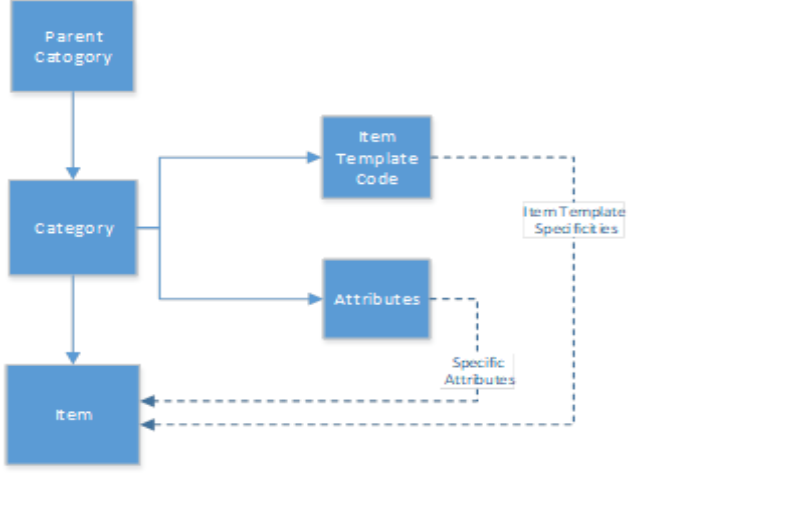

# Item categories

Item categories provide a logical way to group items with similar class or attributes. You can assign each category to a parent category, which will determine the item hierarchy. The categories are mainly used for reporting, or for filtering lists. 

When defining a category, we can set various specificities using the **Item Template & Attributes** that will be assigned automatically to the item which will use that category. 

### Related links

- [Item categories (reference guide)](../reference/item_categories_ref.md)