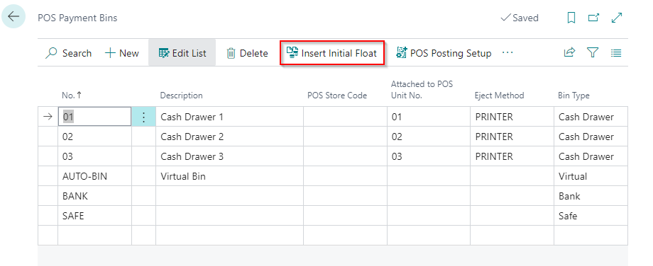
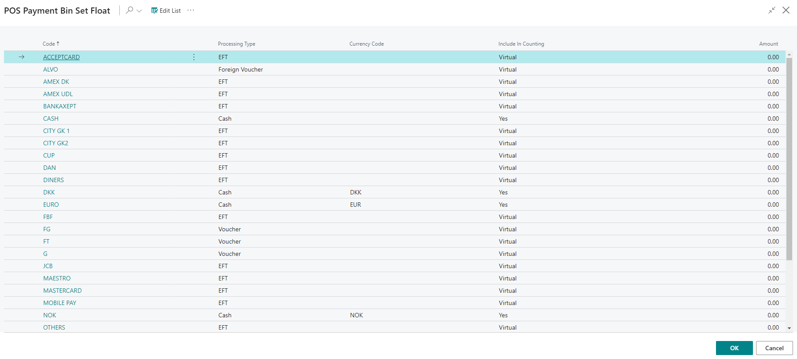
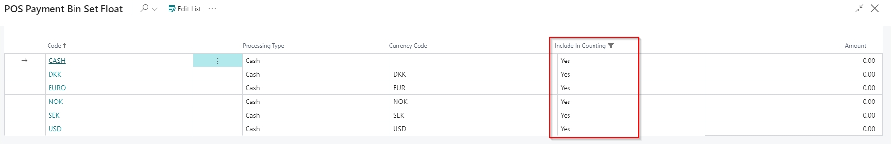

# Insert the initial float for a POS unit

A float is an amount of cash that needs to be available in the cash register at the beginning of each workday. To set up the initial float for POS units, follow the provided steps: 

1. Click the  button, enter **POS Payment Bin**, and choose the related link.     
2. Select the **POS Payment Bin** that you want to assign Initial float and click **Insert Initial Float** in the ribbon.

A window with all available POS payment methods is displayed.

      

> [!Note] 
> You can set a filter on the payment methods that you want to count in the balancing screen, so that you reduce the amount of records in the list.

3. To insert initial float for the filtered payment methods, go to **Edit list** and in field **Amount** insert the float in terms of different currencies that you want to fill in the **POS Payment Bin** for that POS Unit.

Once the initial float is inserted and confirmed by clicking **OK**, you can no longer correct it on the same page. If you try to correct (change) the initial float, an error message stating that the initial float already exists will be displayed.

## Next steps

### Fix incorrect initial float

If a mistake is made, when the salesperson opens the POS unit for the first time, they will have the option to count and correct the error. They will receive the confirmation screen which states if the physical float is the same as the float inserted in the **POS Payment Bin Set Float** page.

If the floats don't match, the salesperson can perform a count, and balance the POS unit before they begin working on it. The salesperson needs to click **No** in the **Confirm Bin Contents** window, and they will be prompted to confirm whether the bin should be balanced. 

When the salesperson clicks **Yes**, the window for balancing will be displayed, and the salesperson will be able to correct the initial float.

### Related links

- [Create a POS payment bin](create_pos_payment_bin.md)