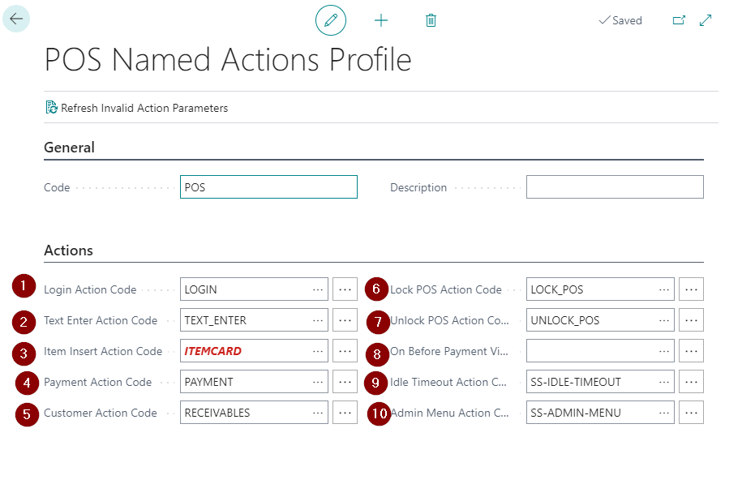
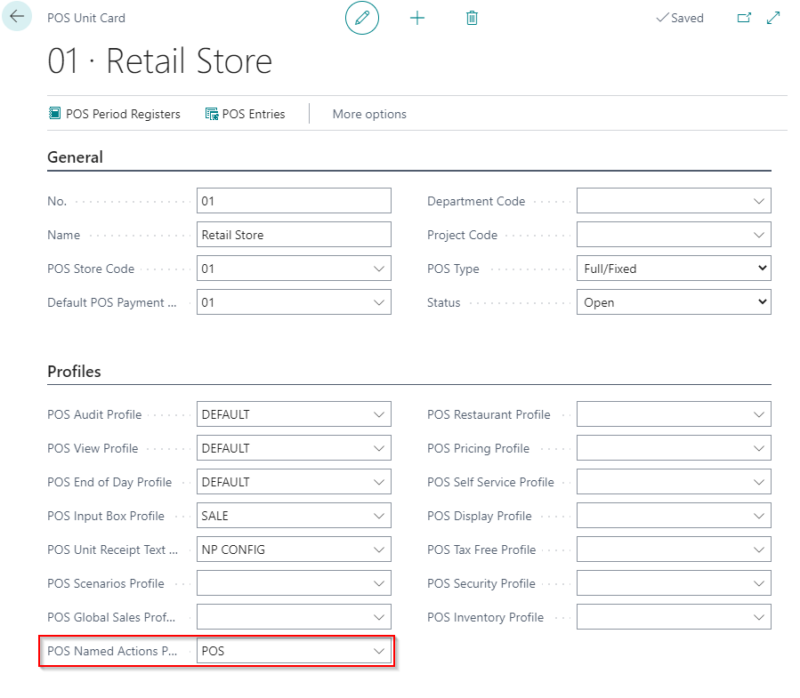

# Set up the POS Named Action Profile

In order to have a working POS unit, certain actions need to be set correctly. This is done with the POS Named Actions profile.   
Follow the provided steps to set all actions that need to be set in order to have a fully operational POS unit.

First, you need to create and set the **POS Named Action Profile**.

1. Click the  button, enter **POS Actions Profiles** and choose the related link.
2. Create **New**.    
   The **POS Named Actions Profile** window is displayed.
3. Type in the code in the **General** section.
4. Populate the fields in the **Actions** section with the correct actions:

| Field Name      | Description |
| ----------- | ----------- |
| **Login Action Code** (required)       | Add the action *LOGIN*.     |
| **Text Enter Action Code** (required)   | Add the action *TEXT_ENTER*.        |
| **Item Insert Action Code** (required)  | Add the action *ITEM*. |
| **Payment Action Code** (required) | Add the action *PAYMENT*. |
| **Customer Action Code** (required) | Add the action *INSERT_CUSTOMER* or *CUSTOMER_SELECT*. |
| **Lock POS Action Code** | Add the action *LOCK_POS*. |
| **Unlock POS Action Code** | Add the action *UNLOCK_POS* |
| **On Before Payment View Action Code** | Populate this field with an action that should work before finishing the payment in the POS. |
| **Idle Timeout Action Code** | Add the action *SS_IDLE_TIMEOUT*. |
| **Admin Menu Action Code** | Add the action *SS_ADMIN_MENU*. |

## Next steps

### Add the POS Named Action Profile to the POS Unit

After setting up the POS Named Actions Profile, you need to add it to the POS Unit.

1. Click the  button, enter **POS Unit list** and choose the related link.

2. Open the **POS Unit Card**.
3. Provide the prepared POS profile in the **POS Named Action Profile** field. 

### Related links

- [Set up the POS Global Sales Profile](POS_Global.md)
- [POS view profile](../reference/POS_view_profile.md)
- [POS unit Receipt Text Profile](../explanation/POS_unit_Receipt_profile.md)