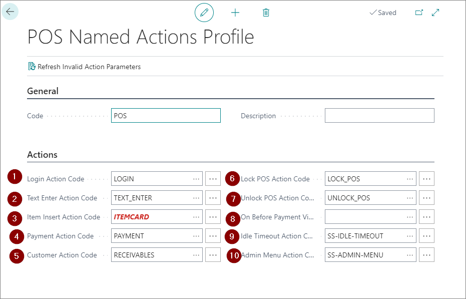
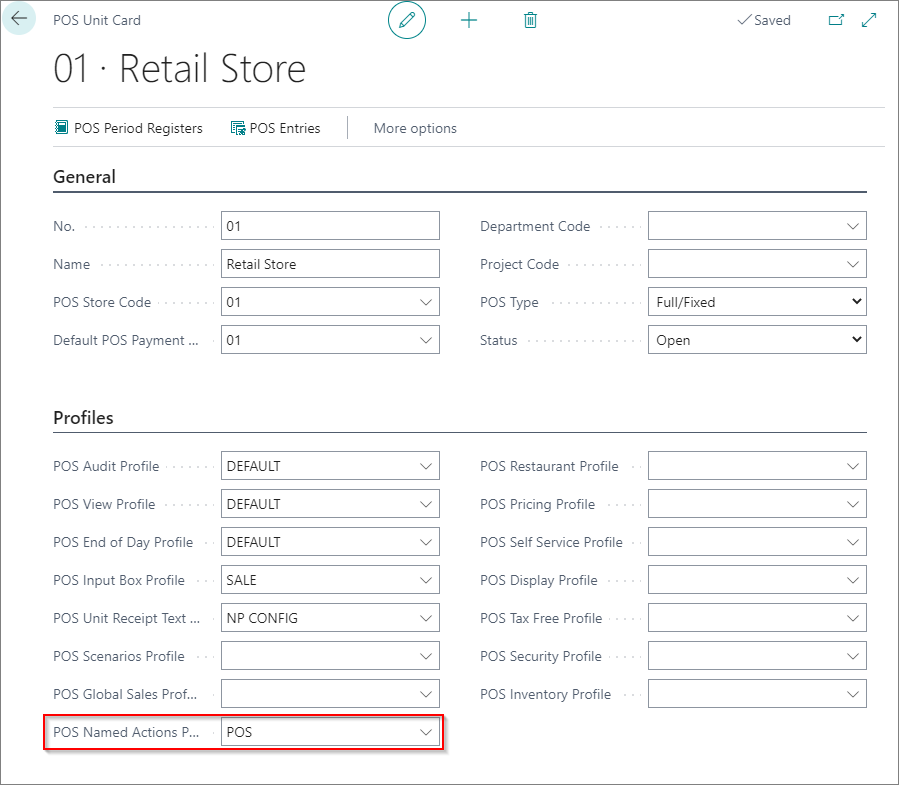

### Setting POS Named Action Profile

Fist thing that needs to be done is create and set **POS Named Action Profile**.

1. Search **POS Actions Profile**

2. Create New.
3. Type in the code

Next thing to to is to set necessary actions in order to get POS working.
On **Actions** tab there are fileds that need to be filled with correct action.
Avaiable fields:
1. **Login Action Code** - add action LOGIN
2. **Text Enter Action Code** - add action TEXT_ENTER
3. **Item Insert Action Code** - add action ITEM
4. **Payment Action Code** - add action PAYMENT
5. **Customer Action Code** - add action INSERT_CUSTOMER or CUSTOMER_SELECT
6. **Lock POS Action Code** - add action LOCK_POS
7. **Unlock POS Action Code** - add action UBLOCK_POS
8. **On Before Payment View Action Code** - this filed should be populated with an action that should work before finishing payment in POS
9. **Idle Timeout Action Code** - add action SS_IDLE_TIMEOUT
10. **Admin Menu Action Code** - add action SS_ADMIN_MENU

Neceessay fields that must be filed are:
1. **Login Action Code**
2. **Text Enter Action Code**
3. **Item Insert Action Code**
4. **Payment Action Code**
5. **Customer Action Code**

All other fields are opptional.

### Add POS Named Action Profile on POS Unit

Prepared POS Action Profile needs to be set on POS Unit.

1. Search **POS Unit list**

2. Open POS unit card
3. In filed **POS Named Action Profile** add prepared POS profile

