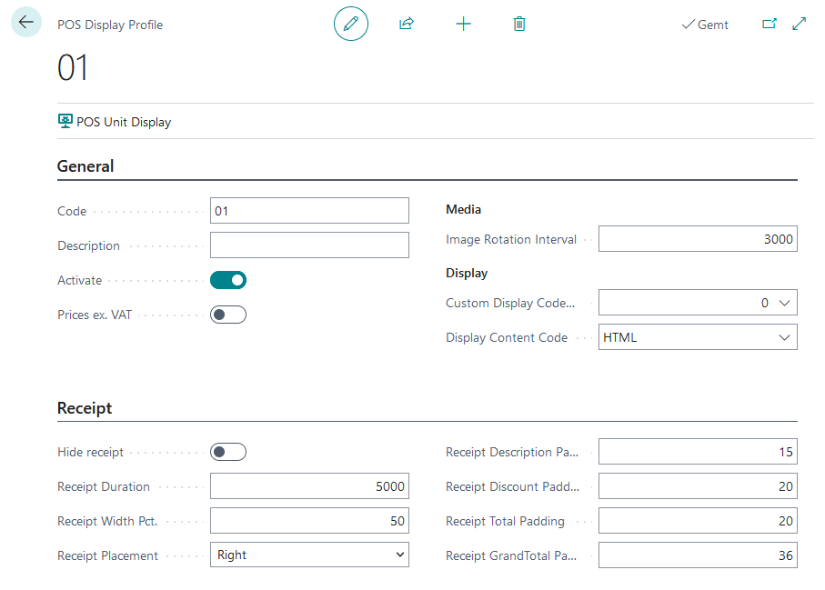
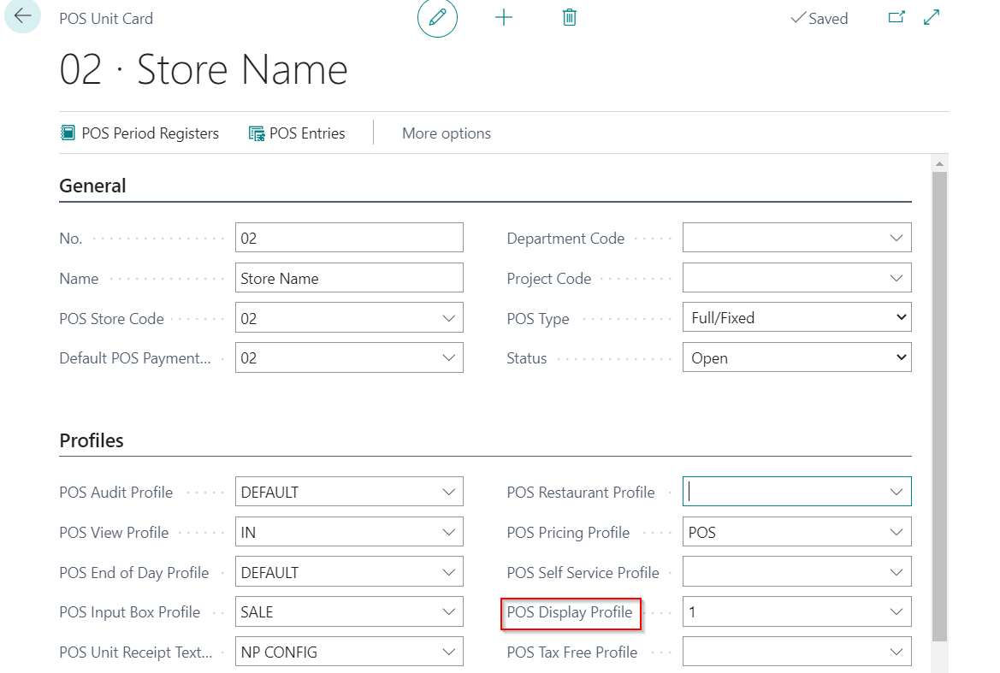

#POS ( Point of Sale) Display Profile

Each POS unit can have different display view and that depends of the needs.

## POS Display Profile Setup

1. Search **POS Display Profile**.
2. Create New
3. Add **Code**.
4. Add **Description**.
5. Boolean **Active** defines if this POS Display Profile is active in Customer Display.
6. Boolean **Price exc.VAT** defines if prices are visble without the VAT on POS.
7. Filed **Image Retation Interval** specifies the time-delay between the images, ie. the duration an image is displayed (in milliseconds).
8. **Media Downloaded** specifies whether the media from Display Content Code should be downloaded. 
>[!NOTE]
>If checked, the POS won't download any media when loaded. The POS will NOT check if the local cache contains the images in the Display Content Code group. Instead it will "download and replace all, or do nothing". When adding new media to the Display Content Codes, you need to deactivate this field to see the new media.
9. **Custom Display Codeunit** specifies the customized codeunit used for out-of-the-box functionality. 
Adding a Codeunit ID here will expand on the base funcitonality and/or set usage or limitations that could override existing fields. If using a Custom Display Codeunit, read the documentation on that Codeunit.
10. **Display Content Code** specifies the Display Content Code group that will be used for this POS Display Profile. 
Display Content Codes are groupings of either images, videos, or URLs. This is where the media displayed on the Customer Display is uploaded or linked to.
11. **Screen No.** specifies the Windows display number that will be used. '0' is default and will auto-select a non-main display. 
It is recommended to leave it on '0' unless the POS Unit has more than 2 screens.
12. Boolean **Hide Receipt** defines if the receipt should be removed from the Customer Display.
13. **Receipt Duration** specifies the duration (in milliseconds) that the receipt will stay on-screen.
14. **Receipt Width** specifies the width of the whole receipt on the Customer Display.
15. **Receipt Placement** specifies the alignment of the receipt on the screen.
    It can be Right, Left and Center.
16. **Receipt Description Padding** specifies the size of the field containing the Sales Line Description.
17. **Receipt Total Padding** specifies the size of the fields that contain the Sales Line Totals (i.e. Quantity x Unit Price).
18. **Receipt Grand Total Padding** specifies the size of the field that contains the Total for the entire sale.

## POS Display Profile on POS Unit

Defined POS Display Profile need to be set on POS unit i order to have all setting applied on POS unit.

1. Search POS unit list
2. Select POS unit
3. Add predifined POS Display profile in the field **POS Display Profile**

