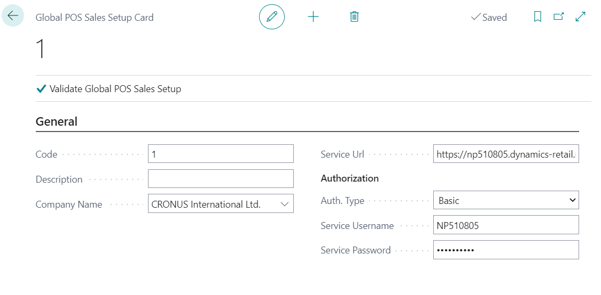
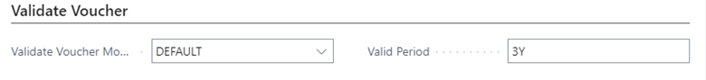
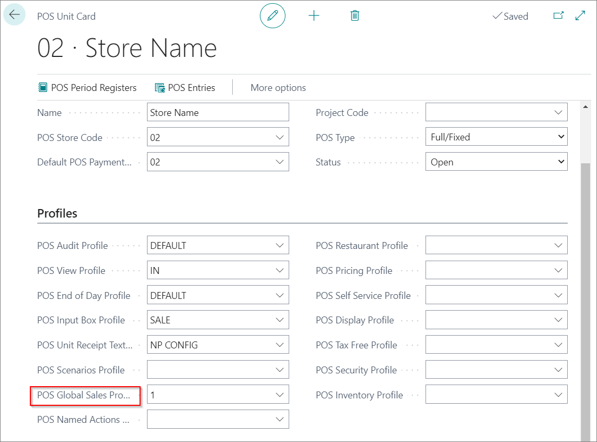

# POS Global Sales Profile

If there is multiple companies and each company has POS (Point of sale) units there is a way to have one master company where all POS transastions will be documented.

### Global POS Sales Setup

First thing that needs to be done is to set **Global POS Sales Setup** in all companies that will send their POS transaction to the master company.

1. Seach **Global POS Sales Setup**
2. Create New.
3. Add a **Code**.
4. Add **Description**.
5. In field **Company name** choose master company.

**Service URL** and Authorization fields will be automaticaly populated.

CLick on **Validate Global POS Sales setup** to complete the setup.

### Setting POS unit

1. Search **POS Unit List**
2. Open POS Unit card
3. In field **POS Global Sales Profile** choose prepared POS Global Sales setup

## Global POS Sales Entries

In master company there is a way to track all POS trasnasction from other slave companies.

Serach **POS Global Sales Entries**
On this page you can see in wich POS Store, POS unit on wich date was sales completed in POS. Also you can see which items are sold f=in each transaction.