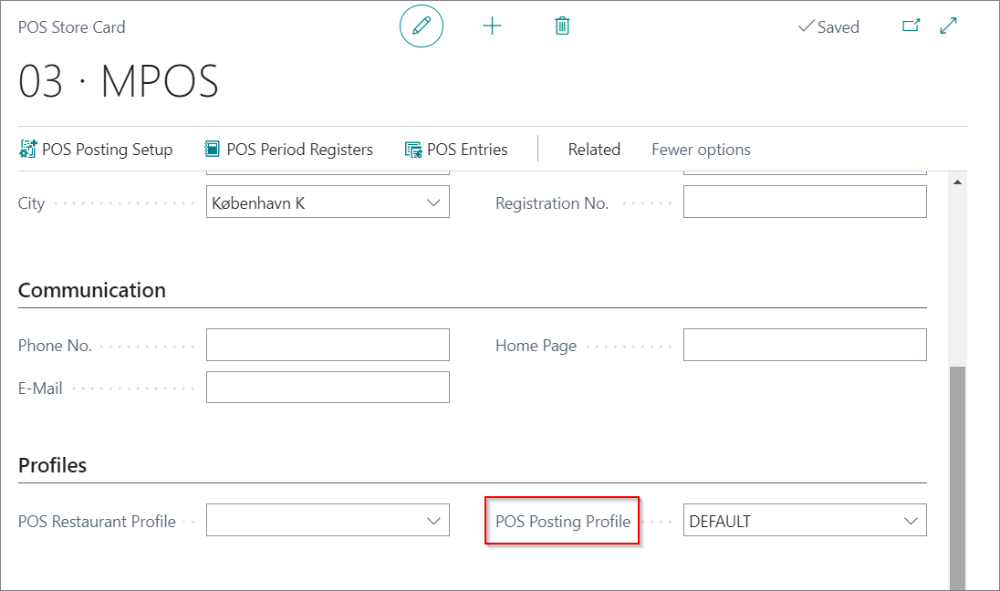

# POS( Point of sale) Posting Profile

Each POS unit can have different set of posting rules.

## POS Profile setup

First thing is to set POS Posting Profile.

1. Search **POS Posting Profile**
2. Create New
3. Add Code
4. Add Description
5. Field **Default POS Posting setup** has two values: Store and Customer. It defines if rules will apply to the POS store or Customers.
6. Field **Sorce Code** should be set to Retail.
7. In field **General Business Posting Group** should be set with predefined posting group. 
8. In field **VAT Business Posting Group** should be set with predefined VAT posting group.

>[!NOTE]
>If there is a need fields **Tax Area Code** and **Tax Liable** can be set.

9. Posting Compression - defines how POS entries will be posted. 
   It can be : Uncompressed, Per POS Entry, Per POS Period.
10. Journal Template name - Specifies the value of the Journal Template Name which will be assigned to General Journal Lines in the POS Posting activity.
11. In FIeld **Max POS Posting Differences** define max difference that will be allowed that are caused by currencies.
12. In field **Difference Account** define G/L account on which these diferrences will be posted.

13. In field **POS Sales Rounding Account** - define G/L account where all sales rounding amounts will be posted.
14. In field **POS Sales Amount Rounding**- difine on which decimal amounts should be rounded.
15. In filed **Rounding Type** - define how rounding should work. It can be set on **Nearest**, **Up** or **Down**.

## Adding POS Posting Profile on POS Store

1. Search **POS Store List**
2. Select POS store that need to have prepared POS Posting Profile
3. In filed **POS Posting Profile** add prepared POS Posting Profile

