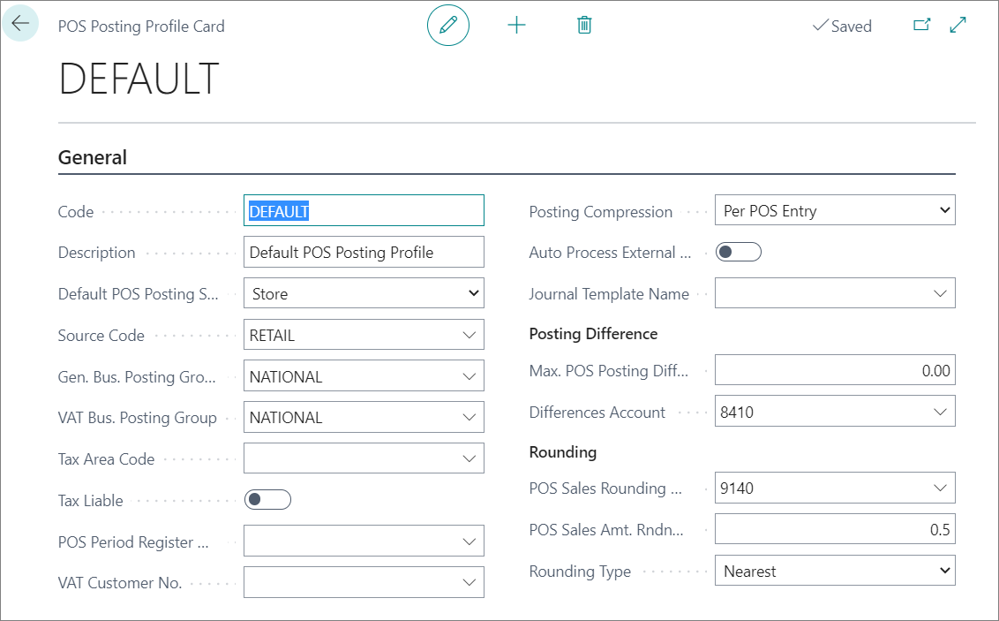

# Set up POS Posting Profile

Each POS unit can have a different set of posting rules. First thing is to set POS Posting Profile.

1. Click the  button, enter **POS Posting Profile** and choose the related link.
2. Create **New**.
3. Add the **Code** in the indicated field.
4. Add a **Description**.
5. Make a selection between **Store** and **Customer** in the **Default POS Posting Setup** field.   
   Your choice determines whether rules will apply to the POS store or customers.
6. Set the value of the **Source Code** field to **Retail**.
7. Set the predefined posting group in the field **General Business Posting Group**. 
8. Set the predefined VAT posting group in the field **VAT Business Posting Group**.

> [!NOTE]
> The **Tax Area Code** and **Tax Liable** fields can be set if necessary.

9. Define how the POS entries will be posted in **Posting Compression**.
   You can choose between **Uncompressed**, **Per POS Entry**, **Per POS Period**.
10. Specify the value of the **Journal Template Name**, which will be assigned to **General Journal Lines** in the POS Posting activity.
11. Use the **Max POS Posting Differences** field to define the maximum allowed difference caused by the difference between currencies.
12. Define the G/L account on which these differences will be posted in **Difference Account**.
13. Use the **POS Sales Rounding Account** field to define the G/L account in which all sales rounding amounts will be posted.
14. Define on which decimal spaces the rounding will be performed in the **POS Sales Amount Rounding** field.
15. Define how the rounding will be performed in **Rounding Type**.  
    The possible settings are **Nearest**, **Up** or **Down**.

## Next steps

### Add the POS Posting Profile to the POS Store

1. Click the  button, enter **POS Store List** and choose the related link.
2. Select the POS store to which you want to link the prepared POS Posting Profile.
3. Add the prepared POS Posting Profile to the **POS Posting Profile** field.

### Related links

- [Balance the POS (Z-report)](../howto/balance_the_pos.md)
- [POS Display Profile](../explanation/POS_Display_profile.md)
- [POS Unit Receipt Profile](../explanation/POS_unit_Receipt_profile.md)
- [POS View Profile](../reference/POS_view_profile.md)
- [POS Audit Profile](../reference/POS_audit_profile.md)
- [POS End-of-Day Profile](../reference/POS_End_of_Day_Profile.md)
- [Set up the POS Global Sales Profile](../howto/POS_Global.md)
- [Set up POS Pricing Profile](../howto/POS_Pricing_profile.md)
