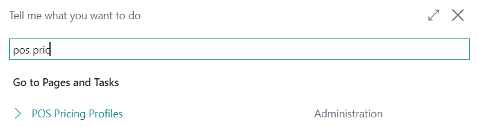
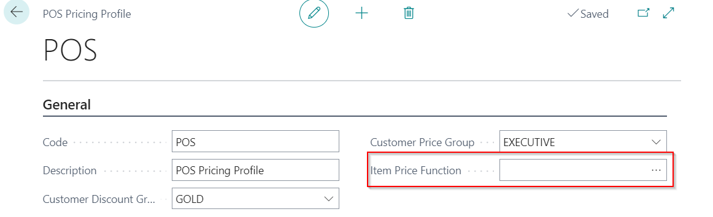

# POS ( Point od sale ) Pricing Profile

Each POS can have different  customer price lists, customer discount list and price matching.

## POS Pricing Profile Setup 

1. Search **POS Pricing Profile**

2. Create New.
3. Type in the name of POS Pricing Profile in field **Code**
4. Add **Description**
5. In field **Customer Pricing Group** select corresponding value of Customer pricing group
6. In field **Customer Dicount Gruop** select corresponding value of Customer disount group

7. In field **Item Price Function** there is a option to choose between :    
 7.1. **Find Best Retail Price function**   
 7.2. **Find HQ Connector Price**

 

 

## Setting POS Pricing Profile on POS Unit

Created POS Pricing Profile needs to be set on POS unit in order to have settings applied on POS unit

1. Search **POS unit list**
2. Open POS Unit card
3. In field **POS Pricing Profile** add created profile.

