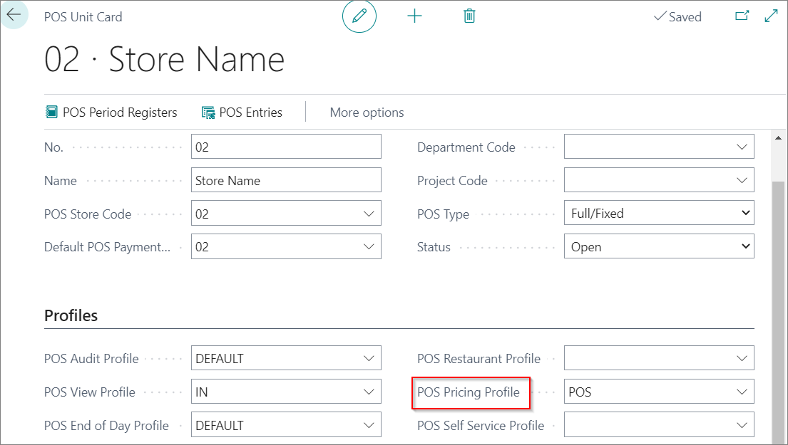

# Set up POS Pricing Profile

Each POS can have different customer price lists, customer discount list, and price matching. To set up POS pricing profiles, follow the provided steps:

1. Click the  button, enter **POS Pricing Profiles** and choose the related link.
2. Create **New**.
3. Type in the name of POS Pricing Profile in the field **Code**.
4. Add a **Description**.
5. In the field **Customer Pricing Group** select the corresponding value of the customer pricing group.
6. In the field **Customer Discount Group** select the corresponding value of customer discount group.

7. In the field **Item Price Function** choose between :    
   - **Find Best Retail Price function**   
   - **Find HQ Connector Price**

 

## Setting POS Pricing Profile on POS Unit

The created POS Pricing Profile needs to be set on a POS unit for the settings to be applied:

1. Click the  button, enter **POS Unit List** and choose the related link.
2. Open the **POS Unit Card**
3. Add the created profile in the **POS Pricing Profile** field.

### Related links

- [Balance the POS (Z-report)](../howto/balance_the_pos.md)
- [POS Display Profile](../explanation/POS_Display_profile.md)
- [POS Unit Receipt Profile](../explanation/POS_unit_Receipt_profile.md)
- [POS View Profile](../explanation/POS_view_profile.md)
- [POS Audit Profile](../explanation/POS_audit_profile.md)
- [POS End-of-Day Profile](../explanation/POS_End_of_Day_Profile.md)
- [Set up the POS Global Sales Profile](../howto/POS_Global.md)
- [Set up POS Posting Profile](../howto/POS_Pos_Prof.md)