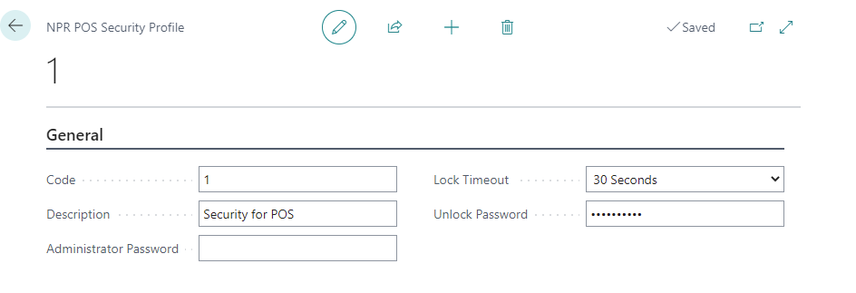

# Set up the POS Security Profile

In **POS security profile** it is possible to set up administrator password and the password for unlocking a POS unit after the unit has been locked due to non-activity.

To set up the security profile, follow the provided steps:

1. In the **General** insert **Code** and **Description**.      
   The **Code** has to be unique for for each profile, while the **Description** field should contain a short description of the profile.

2. Provide the **Administrator Password**.       
   It can be assigned to different buttons in the POS menu, so if someone presses the button the administrator password should be provided in the pop up window. 

3. Set the **Lock Timeout**, i.e. the time of non-activity after which the POS unit will be locked.

4. Provide the **Unlock Password**.      
   This password will be used for unlocking the POS unit.

### Related links

- [Balance the POS (Z-report)](../howto/balance_the_pos.md)
- [POS Display Profile](../explanation/POS_Display_profile.md)
- [POS Unit Receipt Profile](../explanation/POS_unit_Receipt_profile.md)
- [POS View Profile](../explanation/POS_view_profile.md)
- [POS Audit Profile](../explanation/POS_audit_profile.md)
- [POS End-of-Day Profile](../explanation/POS_End_of_Day_Profile.md)
- [Set up the POS Global Sales Profile](../howto/POS_Global.md)
- [Set up POS Posting Profile](../howto/POS_Pos_Prof.md)