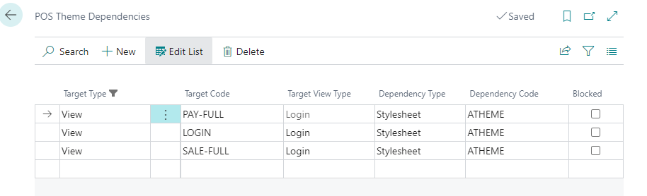
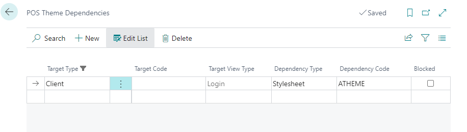
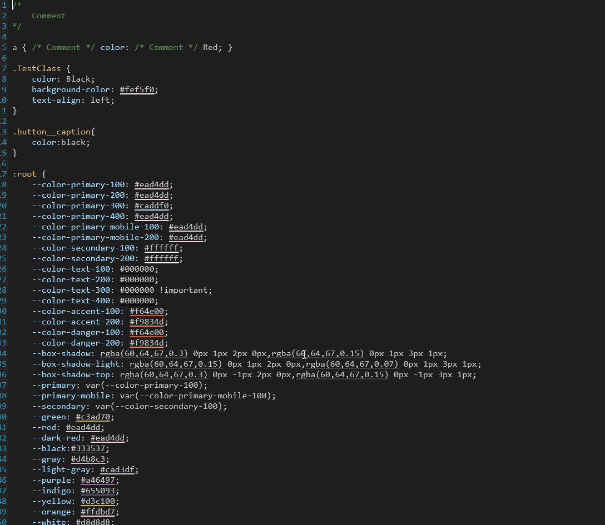
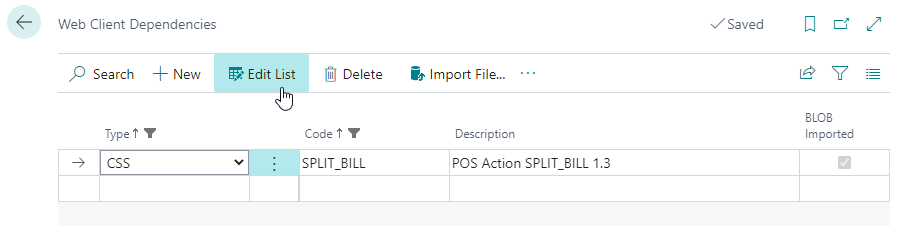
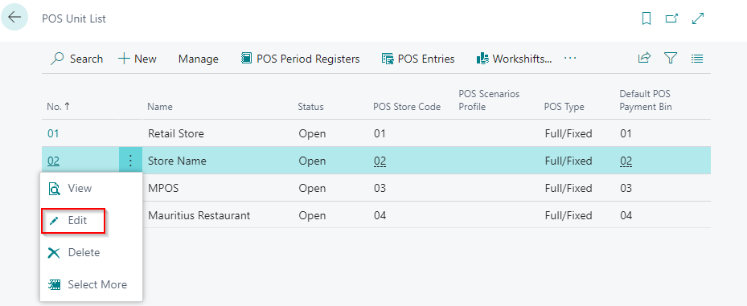
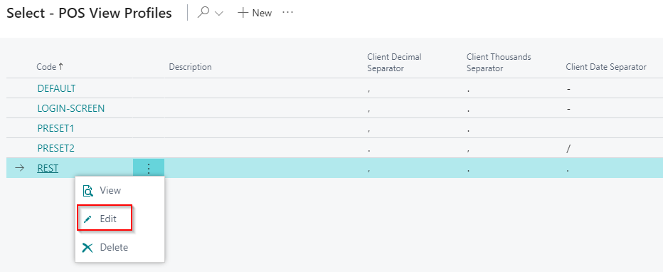
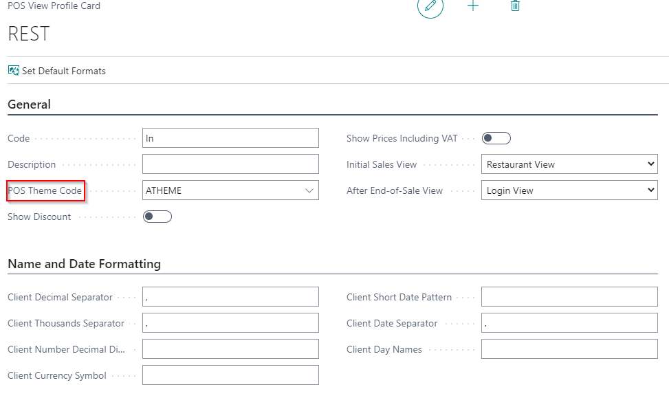

### POS Theme

1. Go to POS theme page.
2. Create New.
3. Go to Them Dependencies.

There are two scenarios:

First scenario:

1. In coloumn Target type choose wich view you want to customizes. If you choose Target type -view you can select only one POS view profile that will be customized.

2. That is selected in column - Target code.
3. Default target code - PAY-FUll, LOGIN, SALE-Full
4. Column Target view type is set normally to Login.
5. In column Dependency Type you can choose what will be affected with this   change - Logo, Background or Stylesheet.
6. In Dependency code you choose which cutomization will be applied.

Second scenario:

1. If you choose Target Type- Clinet, changes will be applied to everything.

2. Column Target view type is set normally to Login.

3. In column Dependency Type you can choose what will be affected with this change - Logo, Background or Stylesheet.

### Custimize colour of POS bottoms

First step when customizing POS bottoms is preparing CSS file. Each bottom can have their customized colour. Pictures are also imported as a CSS files.

### Web client depender

When CSS file is prepared next step is uploading all changes that are made in CSS file.

1. In search type in  Web Client Dependencies. 

2. Create a new line. 

3. In coloumn type choose CSS, code should be name of your CSS file and description should be added.

4. Import prepared CSS file.

### Setting POS theme on POS unit

1. Go to POS unit list.
2. Select the POS unit that needs to have new customized theme.

3. Go to the POS View Profile. 

4. Choose a POS View Profile that needs to have this customization.
5. CLick on Edit

6. In filed POS Theme Code choose Web clinet dependencie file that containe all necessary customatizations.

### POS bottom size

Number of POS bottoms and size of bottoms can be customized as well.

1. Go to POS view list. 
2. Most common POS Views that are used are Login, Pay FULL and SALE FULL.
3. Click on Edit.

3. There you can set how many bottoms should be visable, size of the bottoms nad size of the base. 

