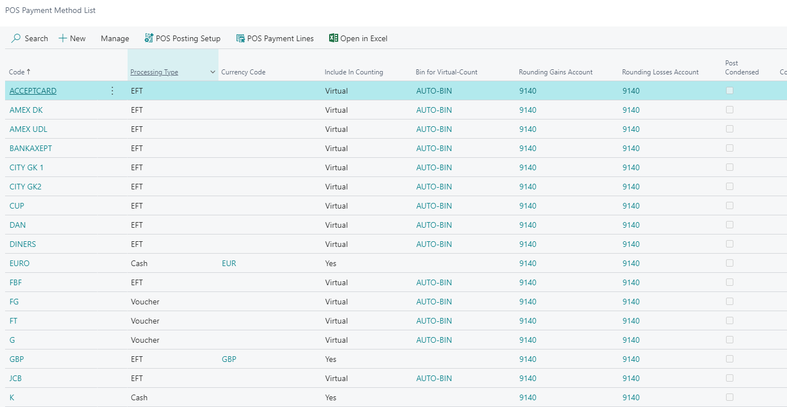

# Create a POS payment method

POS payment methods are methods used in the POS for creating payment lines (like cash and credit cards). Every POS payment method that is created can be set up in buttons and used for conducting payments during sale.

**POS Payment Method List** is an administrative section which contains all Payment methods created for the POS.

All of these payment methods have their own cards where all necessary parameters are set up. To open a certain payment method card, highlight its line, and click **Manage** in the ribbon, followed by **View** in the dropdown. 

To create new POS payment method, follow the provided steps:

1. Click the  button, enter **POS Payment Method** and choose the related link. 
2. Create **New**.
3. Insert a unique **Code** for the payment method and a **Description** in the designated fields.
4. Choose a **Processing Type** for the payment method.      
   The available options are **Cash**, **Voucher**, **Check**, **EFT** (used for credit cards), **Foreign Voucher**, and **Payout**.
5. Choose **Return Payment Method Code**. This field define which payment method will be used for creating charge in sales transactions.
6. Enable **Block POS Payment** if you wish to block the payment method so it can't be used in the POS.
7. If the drawer needs to open when the payment method is used, enable **Open Drawer**.

8. In the **Include in Counting** field state if the payment method will be included in the counting during the end-of-day process. The following options are available:
   - **Yes** - During the counting process, you will have shown column with the system amount.
   - **Yes - blind** - During the counting process, the system amount column will not be displayed.
   - **Virtual** - Virtual counting is created by the system. If selected, you need to pick a bin that will be used for counting in the **Bin for Virutal Counting** field.
   - **No** - The payment method will not be included in the counting process.
9.  If this payment method is using a currency that isn't local, assign the correct currency in the **Currency Code** field and the currency rate in the **Fixed Rate** field.
10. If you wish the posted entries to be compressed, check the **Post Condensed** field.
11. Check **Zero as Default** if you want zero to be the amount that will pop up when this payment method is selected.
12. If you wish the sale to end after the payment is performed with this payment method, check **Auto End Sale**.
13. If you wish to add a limit on the **Minimum Amount** on web orders, enable **No Min Amount on Web orders**.
14. Set up **Rounding Precision**, **Rounding Type** and **Rounding Gains/Losses Accounts**.

15.  If refund is allowed, enable **Allow Refund**.
16.  Use **Min Amount** and **Max Amount** if the payment method has a limit for the minimum and maximum amounts.

### Related links

- [EFT setup](../../eft/explanation/EFT_setup.md