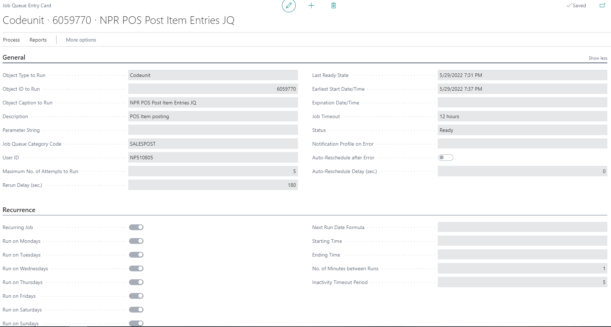
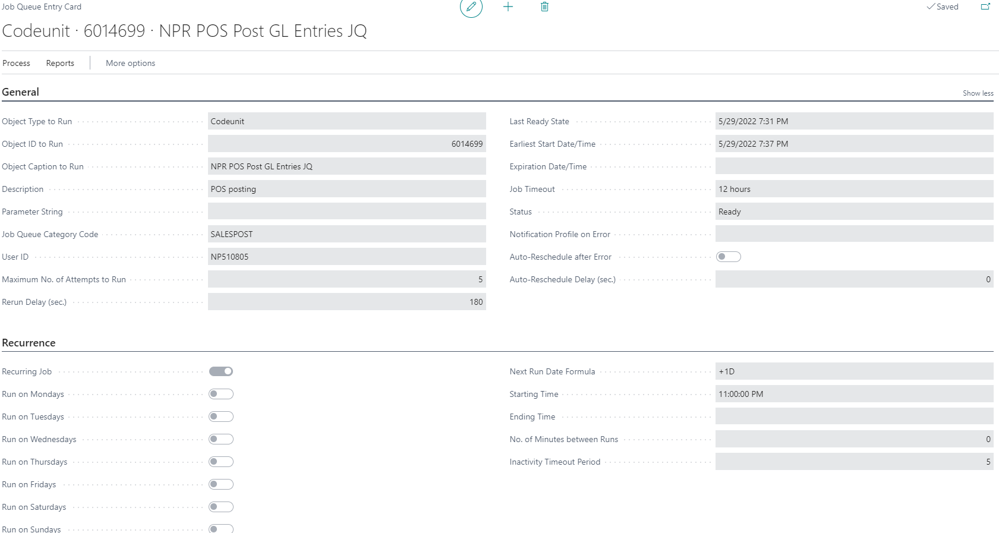

# Set up job queue to post POS entries

After the  sale is finalized, the POS entry is created. This entry has **Post item entry status** and **Post Entry Status** - UNPOSTED. The entry can be posted manually, but it is more common to create jobs in **Job Queue Entry**, which will post the entry. To set up this flow, follow the provided steps:

1. Click the  button, enter **Job Queue Entries** and choose the related link.     

2. Set up the following jobs:  

    - **NPR POS Post Item Entries - Code Unit 6059770**    
    This job is used for posting sale to item ledger entries. It is set up usually with **No. of minutes between runs** = 1, so the inventory in all locations can be updated in every minute.

    

    - **NPR POS Post GL entries – Code Unit 6014699**     
     This job is used for posting sales and payment to G/L accounts.

    

    - **NPR Post Inventory Cost to G/L – Code Unit 6014683**    
     This job is used for posting inventory to G/L accounts.

All data is automatically saved.