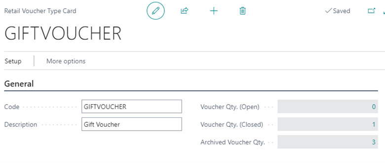
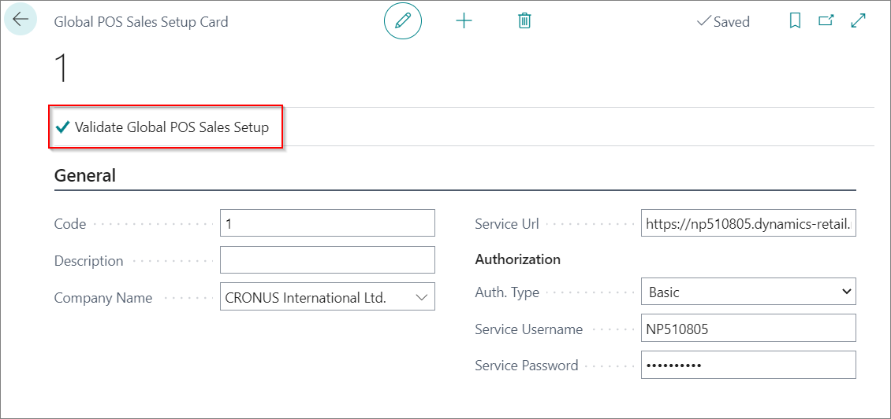
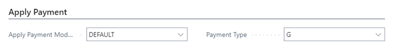

#Voucher types

Retail vouchers can be used as a payment type, so owner of voucher can use it for purchase of goods and services.

Voucher types are different typers offered by a retailer. Most used retail vouchers are Gift vouchers and Credit vouchers. In voucher type card there is four sections: **General**, **Send voucher**, **Validate Voucher**, **Apply Payment**.

In **General** section is defined **Code** and **Description** of voucher. Also, in this section it can be seen number of open, closed and archived vouchers.

In **Send voucher** section it is defined creation of Reference No., account number in which will be posted sale of voucher. Also, in this section is covered method used for sending Retail voucher. Voucher can be sent to printer, via e-mail and via SMS. Template and code unit for sending needs to be setup for all this methods.

If voucher have validity period, this must be defined in **Validate Voucher** section. In moment of using voucher for payment, system will check validity period.

Rules for redeeming vouchers are created in section **Apply Payment**. In this section there is two **Validate Voucher Modules**. **Default** (which means that voucher will be redeemed in total. If sales amount is less than voucher amount, we can define that Credit voucher be created as a refund in **Setup** > **Setup Apply Payment**) and **Partial** (which means that voucher amount will be used partially, and the rest of amount can be used next time).

