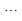

# Balance the POS (Z-report)

The Z-report, or the end of day report, calculates and displays the payments received through that register for the entirety of a day. After this report is run, the cash count is reset to the initial amount you've set to begin the following day with. 

You can define the payment bins like Bank and Safe, and then a common payment bin, where on posting the cash balancing, we transfer them out of the default bin.

The Z-report (Balance V3) transactions consist of three segments:

- Sales on POS

- Balancing of Register

- Auto-count

> [!Note]
> If needed, the reports can be printed.

This article focuses on making a Z-report and counting the contents of the payment bin.

1. From the **POS**, click **Other Functions (menu)**, followed by **End of Day**.     
        
   A selection between X-Report and Z-Report is displayed.
2. Click **Balance Register - (Z-Report)**.   
   If no sales were made that day, an empty register will be balanced. If there were some sales, the **Workshift Details** window displays and you can see the detailed report of achieved sales for the day. 

> [!Note]
> The **Workshift Details** table contains the details of all types of transactions - sales, X-report, Z-report etc. 

3. Click  and then P**Process** followed by **Balance Payment Bin...** in the dropdown list.     
   The **POS Payment Bin Checkpoint** window is displayed. It contains options for counting, transferring and closing of the attached payment bin's contents.    

> [!Note]
> The **Counted Amount Incl. Float** field should include all contents of the bin as counted by the salesperson. It shows how much there should be in the payment bin according to the sales made on the POS.

4. Click on the value in the **Counted Amount Incl. Float** field, and then on the  that is displayed next to the value.    
   The **Coin Types** window is displayed. It helps facilitate the counting and totaling of the payment bin's contents.\
5. Click , and then the **Edit List** button to fill out the list of coin types.   
   The bottom-right corner of the **Coin Types** page displays the total counted amount.
6. Click **OK** to save the counting details and then go back to the **POS Payment Bin Checkpoint** page.   
   The **Counted Amount Incl. Float** field is now populated, and the difference has been calculated and is now displayed in the adequate field. 

> [!Note]
> The **Closing & Transfer** tab is used to transfer cash to another payment bin or a safe, and to deposit cash to a bank bin.

> [!Tip]
> The salesperson can either fill out the **New Float Amount** field or the **Bank Deposit Amount** field. The remaining amount is automatically provided in the other field. So, for example, if you enter 3000,00 into the field **New Float Amount**, then the field **Bank Deposit Amount** is automatically populated with the value 635,0.

7. To finalize the counting and closing procedures, click **Close**, and click **Yes** when prompted to confirm that you wish to finish counting and post results.   
   The counted amount will be visible on the **Workshift Details** page.
8. Finish the entire balancing process by clicking **OK**.    
   You will then be logged out of the POS, and the Z-report will be printed on the receipt printer.

### Related links

- [POS units](../explanation/POSUnit.md)
- [Create a new POS unit (by using the existing one for reference)](./createnew.md)   
- [Configure an opening mechanism for a POS unit cash drawer](./ConfigureCashDrawerOpening.md)