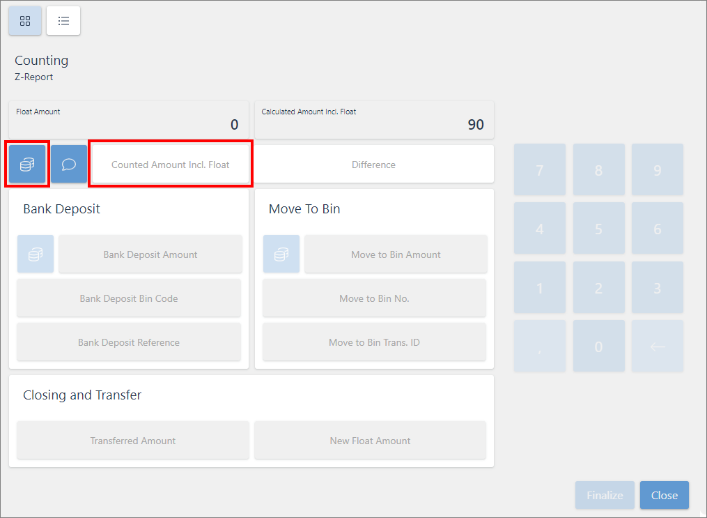

# Generate end-of-day report (POS balance)

The POS balance report, or the end-of-day report, contains the payments received throughout the day on the selected POS unit, and is used for cash count and balancing.

To generate the POS balance report and count the contents of the payment bin, make sure the prerequisite is met and follow the provided steps:

## Prerequisite

- Make sure the balancing processes are [properly configured](balance_pos_v4.md) in Business Central.

## Procedure

1. From the **POS**, click **Other Functions (menu)**, followed by **End of Day Balancing**.     
   The **POS Workshift Checkpoint** is displayed, along with the [Z-Report overview](../explanation/end_of_day.md). To see all work shift statistics, open the **Show All** tab.

   

2. Click **Cash Count** in the lower left corner when you've reviewed the work shift statistics.      
   The counting screen is displayed. In the upper right corner, you can see which currencies have been collected in the payment bin, and are ready to be counted and balanced.     

   

3. Take one of the two possible approaches to counting:
   - Click the coin icon to select every bill and coin denomination for the selected currency which have been deposited in the bin.
   - Input the counted amount in the **Counted Amount Incl. Float** field.

   > [!Note]
   > If the calculated and the counted amount are different, this will be recorded in the **Difference** field automatically.

4. (Optional) Click the dialog box icon to add a comment which will let users know what caused the difference between the amounts.
5. Enter the amount that should be deposited to the bank in the **Bank Deposit** field.
6. Enter the amount that should be deposited to the store safe in the **Move to Bin** field.      

   > [!Note]
   > Once you provide the amount that should be transferred in one of the fields, the remaining amount is automatically populated in the other field. So, for example, if you enter 3000,00 into the field **New Float Amount**, then the field **Bank Deposit Amount** is automatically populated with the value 635,0.

7. Click **Finalize** once the counting is completed.     
   The button will become green, indicating that the amount has been saved and processed.
8. Repeat this process for every currency that needs to be counted.    
   When you open the POS for the next shift, you will be prompted to state whether the recorded payment bin contents are correct. If the contents are incorrect, you can perform balancing again to correct the mistake.

> [!Video https://share.synthesia.io/ec8e0a32-7578-4569-a608-664743059921]
### Related links

- [Configure the POS balancing feature](balance_pos_v4.md)
- [POS Display Profile](../../pos_profiles/reference/POS_Display_profile.md)
- [Create a new POS unit (by using the existing one for reference)](./createnew.md)   
- [Configure an opening mechanism for a POS unit cash drawer](./ConfigureCashDrawerOpening.md)