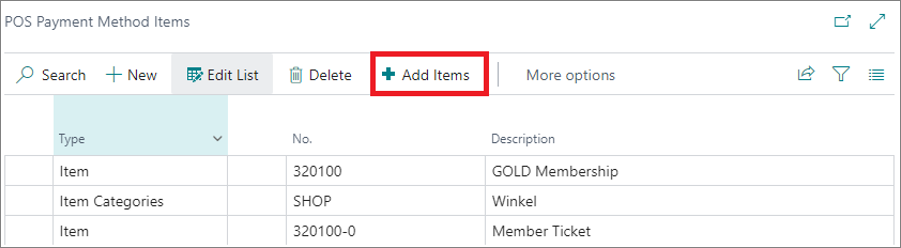

# Limit payment types to specific items

When [creating a new payment method](POS_payment_methods.md), you have the option of singling out specific items or item groups that can be purchased with that method. This option is especially useful when you wish to establish vouchers as viable types of payment for specific items only. 

Examples of such vouchers are [meal, eco, and consumption vouchers](../explanation/belgian_voucher.md), which are used in certain regions for purchasing comestibles, eco-friendly supplies or for temporarily boosting consumption rates. 

To configure which items can be purchased with a specific payment method, follow the provided steps:

1. Click the  button, enter **POS Payment Method List**, and choose the related link.     
2. [Create a new **POS Payment Method**](POS_payment_methods.md) or select one from the list.       
3. Click **POS Payment Method Items** in the **POS Payment Method Card** ribbon to select individual items or entire item categories which can be purchased with the vouchers.   
   The **POS Payment Method Items** window is displayed. 
4. Click **Add Items** to bring up the extended search and find the items more quickly.         
   
   

   Once the items are added, the voucher can be used to purchase these items from the POS. 
