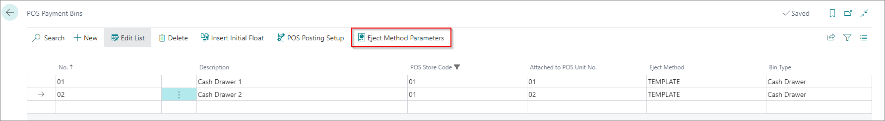
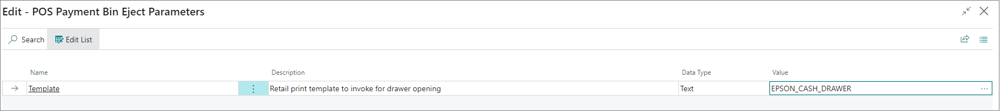
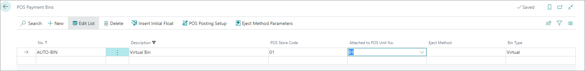
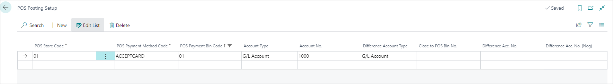

# Set up POS Payment Bins

Each POS unit can have multiple payment bins and different setup. You can set cash drawers and virtual drawers.

To create cash drawers, banks, or safes:

1.  Click the  button, enter **POS Payment Bins** and open the related link.
2. Create **New**.
3. Add a number of cash drawers in the **No.** field.
4. Add **Description** (e.g. *Cash Drawer*)
5. Choose the POS store and POS unit that will have the cash drawer in the **POS Store** and **POS unit** fields.
6. Select **Cash Drawer** in the **Bin Type** dropdown.   

> [!NOTE]
> For the **Bin Type** there are also **Bank** and **Safe** options that have the same function as the **Cash Drawer**. If you need to create a bank, or a safe instead of a cash drawer, choose one of those options instead.

1. In the **Eject Method** field set **TEMPLATE** as the method in which the cash drawer will be ejected.     
    After selection Eject method - Template, **Eject Method Parameters** needs to be set.

 8. Click **Eject Method Parameters**.     
    **Name**, **Description**, and **Data Type** are automatically populated.  
 9. Set the value to **EPSON_CASH_DRAWER**.

To create virtual bins: 

> [!Note]
> Virtual bins are used for payment by card.

1.  Click the  button, enter **POS Payment Bins** and open the related link.
2. Create **New**.
3. In the **No.** field add *Auto_Bin*.
4. Add **Description** *(e.g. *Virtual Bin*).
5. Choose the POS store and POS unit that will have the cash drawer in the fields **POS Store** and **POS unit**.
6. Select **Virtual** in the **Bin Type** dropdown.

## Next steps

### POS Posting setup

Each cash drawer or virtual drawer can be posted on a different G/L account.

1. Open the **POS Posting Setup**
2. Select the **POS Store Code**.
3. Select the **POS Payment Method Code**.
4. Add an **Account**.

