# Set up ItemAddOns

The article consists of main steps that constitute the process of Item AddOn setup, followed by some common use cases, examples, and best practices. 

1. Create the main items that will be sold by configuring the necessary options in their respective **Item Cards.**
2. Define the item addons in the [**Item AddOns**](../reference/item_addons_ref.md) administrative section.
3. Associate the item addons with the main item they are going to sold with. This is done in the **NPR Properties** section of the **Item Card**.
4. Define the [button on the POS Menu](../howto/add_button_to_pos_menu.md) which will be used on the POS unit, if you need a standalone menu, without the main item. 

## Examples, use cases, and best practices

### Item AddOns with fixed quantity

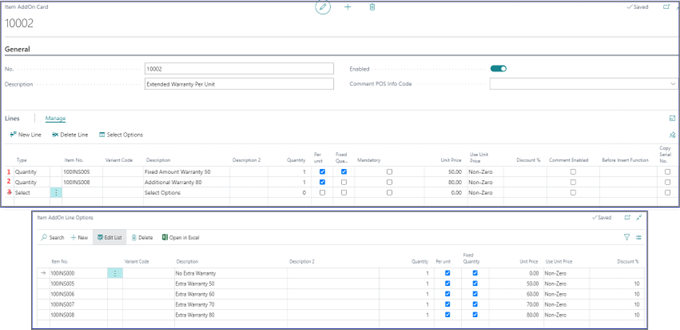

In the example provided above, the first line contains the **Fixed Amount Warranty 50** (which is the item with the item number 100IN005). If the main item is purchased, the item addon of 50 is automatically purchased as well. This is fixed on the main item, but it is possible to decline this configuration, since it hasn't been set as mandatory. 

### Item AddOns without fixed quantity

In the second line of the provided example, **Fixed Quantity** wasn't selected, so the salesperson can modify it on the sales line.

### Item AddOns sub-menu

It's possible to set a sub-menu from which the salesperson can select an option. This is done when choosing the **Select** type in the **Lines** section (as per the 3rd line in the example provided above). As a result, when the main item is inserted, the following window is displayed in the POS: 

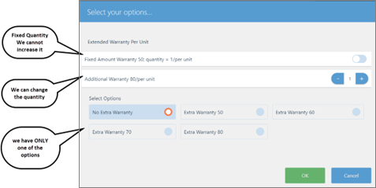

There are three different combinations of outputs: 

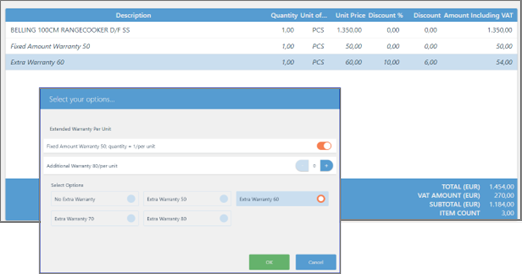

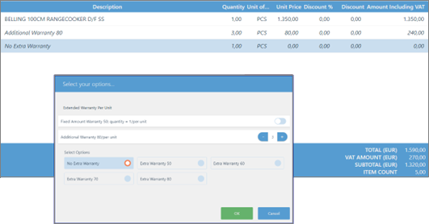

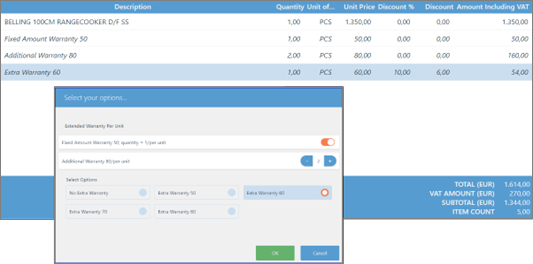

### Item AddOns using percentage of main item unit price

If the logic is changed so that the value of the item addon unit price is a fraction of the main item's unit price, when an item is added, it's not necessary to define a unit price on the **Item Card** of each individual item. 

You can select a predefined workflow under the **Before Insert Function** field (displayed when you expand the **Manage** actions). If you select **Unit Price From Master**, the **Before Insert Setup** setup button becomes visible on the **Lines** header. You will be prompted to insert a percentage of the main item unit price to be sold. 

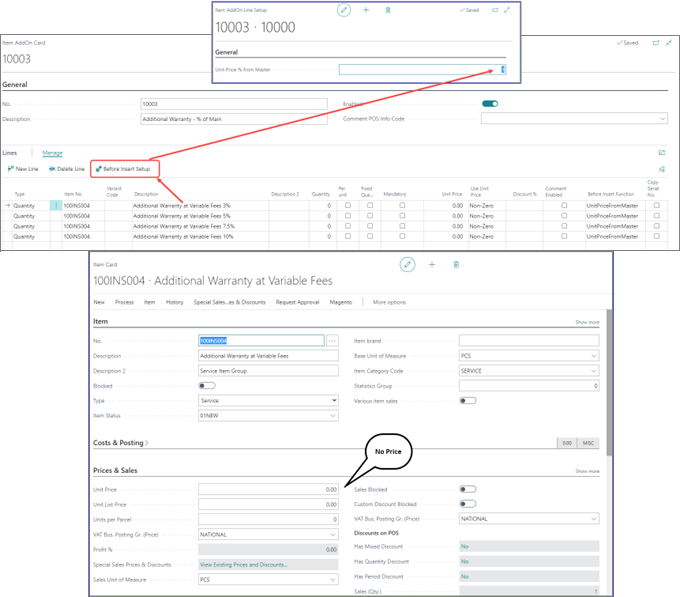

When the main item is sold, the POS button is activated, and you can press it to open the popup with the list of AddOns to choose from. However, this time, the unit price depends on the percentage of the main item that was used in the setup of item addons. In the example, the main item has the unit price of 2000.00.

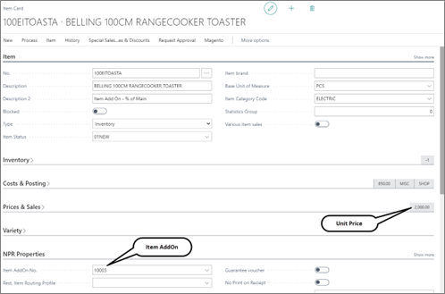

On the POS, the output is displayed as indicated in the following screenshot:

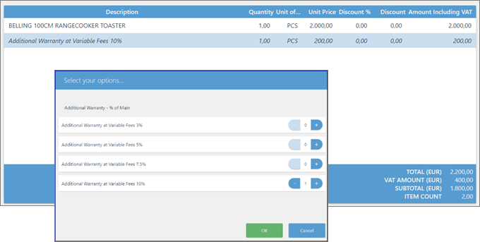

### Item AddOns as a menu

In this example of setting a menu for selling drinks in a café, you can see hos options are used in defining item addons. 

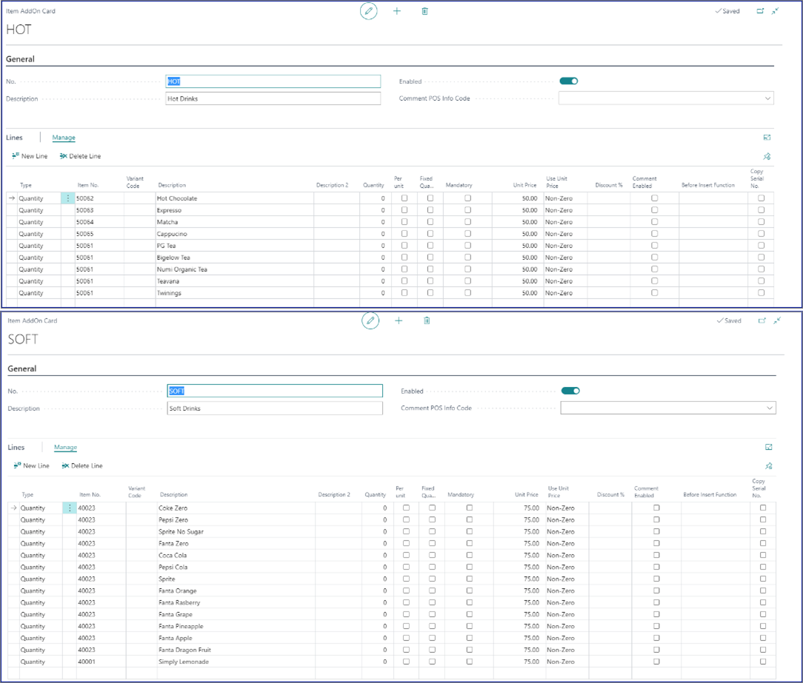

You can define individual items (if you're keeping proper inventory) or one item, but set the name that will be displayed on the sales in the **Item AddOn Card**. For example, you can have an item that is called *Soft Drinks*, and then on the **Item AddOn Card**,  you can change the name to a different brand of soft drinks (in this case, the inventory isn't sorted per a brand, but every soft drink is kept in one big stock).

Another common way of doing this is to define the *Soft Drink* item, but assign variants to it. And in this case, the variant represents each brand. The inventory is kept on variant level. 

On the POS, you can create a button with the *POS Action = RUN_ITEM_ADDONS*.

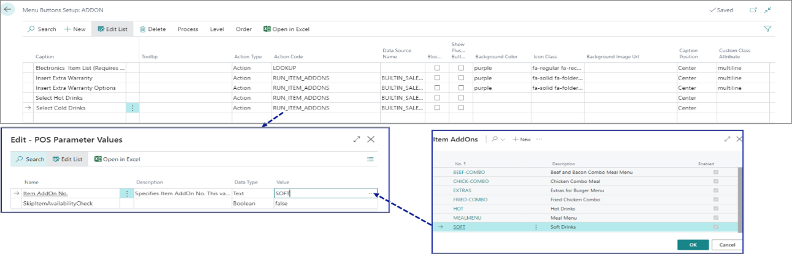

As a result, the output on the POS will be displayed as indicated in the following screenshot:

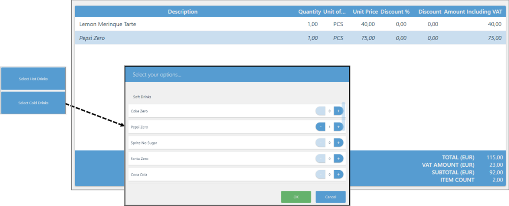

> [!Note]
> The *POS Action = RUN_ITEM_ADDONS* requires that there is already a line in the POS sales line for it to be activated. 

### Item AddOns variations and combinations

We can combine different methods used for Item AddOns. This can be illustrated in the café environment, where combo items are often defined.  

In the case of cold drinks, you can define a single item with different descriptions, and if they are offered as a bonus part of some meals, there will already be a unit price defined in the **Item Card**, so you can set the unit price on the **Item AddOns Menu** as *0.00*. Then, with the **Select Option** you can define different options. You can have a combination of food and one free drink that can be selected from the list of options you provide. 

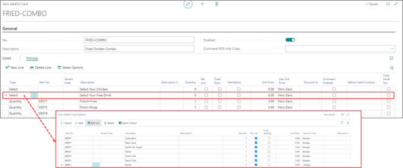

### Item AddOns as extra items

You can support both an item accessory and item addons on the main item. When you select an item which has an item addon as extra, item addons will be activated, and can then be used. If, however, you define only one item in the addon, and set it as mandatory, the item line will be added to the **POS Sales Line** automatically. 

For example, when selling electrical equipment, and if you want to show an extra levy on it, you can attach a service item with the main item. By selling the main item, the system will automatically insert another line for the levy. It can be a fixed amount or percentage of the main item price. These different ways can be defined in the **Item AddOn Card**. 

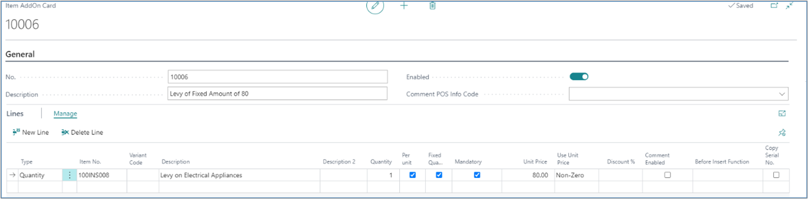

### Related links

- [Item AddOns](../explanation/item_addons.md)
- [Item AddOns (reference guide)](../reference/item_addons_ref.md)
- [POS self-service actions](../explanation/POS_Self_Service_Actions.md)