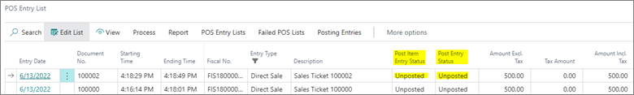
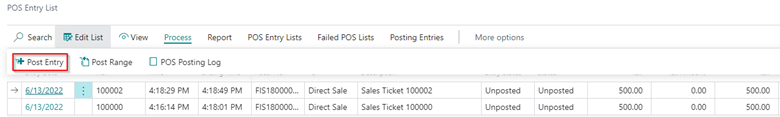
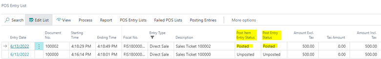

# Manually post POS entries and check if they are posted

After a sale is finalized on the POS, an entry is automatically created in the **POS Entry List** administrative section. In the **Post Item Entry Status** and **Post Entry Status** fields, you can see whether the entry has been posted or not. 

To post an entry manually, follow the provided steps:

1. Select the entry line you wish to post. 
2. Open the **Process** dropdown in the ribbon, and click **Post Entry**.  

   The status of the entry is changed to **Posted** in the **Post Item Entry Status** and **Post Entry Status** fields.

   

> [!Note]
> If you wish to simultaneously post multiple entries, instead of **Post Entry**, use the **Post Range** option.

### Related links

- [Set up job queue to automatically post POS entries](./Set_up_job_queue_to_post_POS_entries.md)
