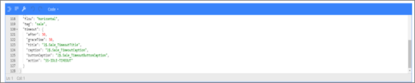
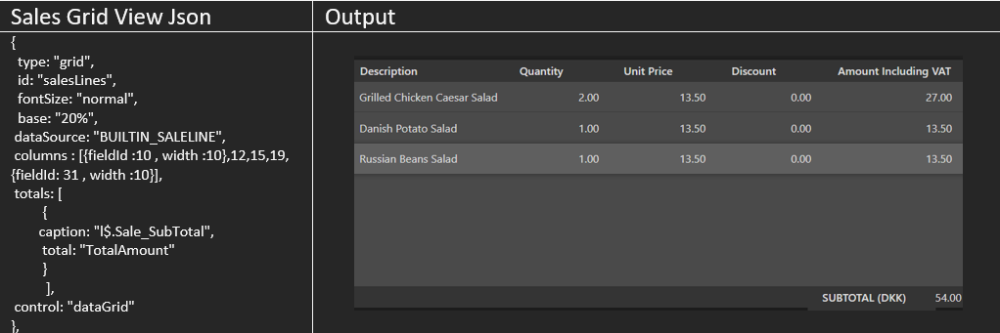
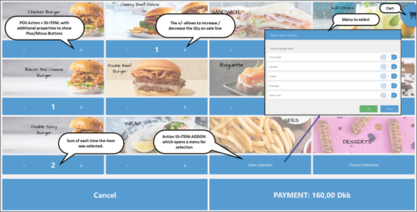
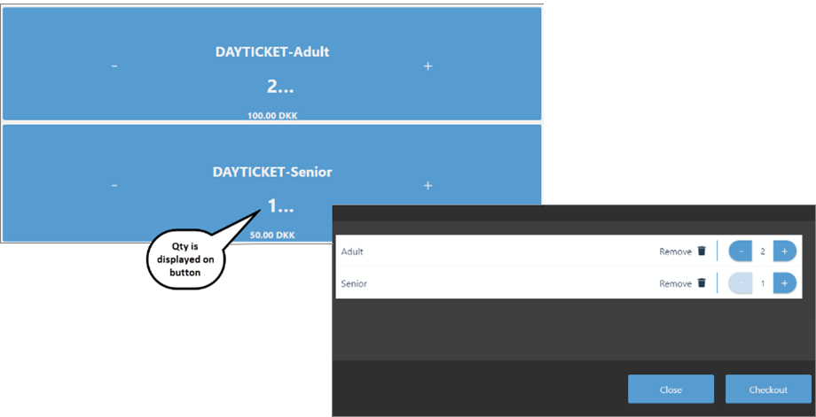
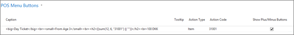
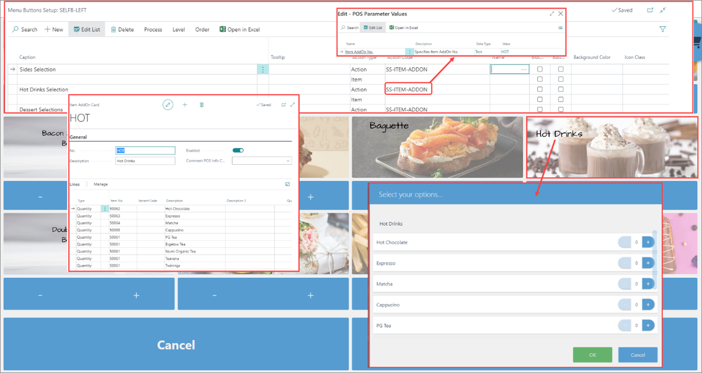

# Set up POS Self-Service Profile

There are specific POS actions for the self-service mode that should be set up. On the POS unit that is dedicated for self-service, the POS setup is configured from the POS Named Action Profile.

To set up the POS unit for self-service, you need to take the following steps:

1. Click the  button, enter **POS Unit** and open the related link. 
2. Select the POS unit you wish to configure the self-service profile for, and open its **POS Unit Card**.
3. Populate the mandatory fields. In addition, also provide the following:
4. In **POS Type** select **Unattended**, to signify that no salesperson will be attending to the POS Unit. 
5. Open the **POS View Profile** setup, and configure the following:
   - Activate **Show Prices Including VAT**.
   - Select **Sales View** in the **Initial Sales View** field. 
   - Select **Login View** in the **After End-of-Sale View** field. 
   - If there's a specific theme that should be used for the customer, define and set it up in the **POS Theme Code** field.
6. Open the **POS End of Day Profile** setup.     
   In it, you need to set up a **Master & Slave** end-of-day type. The self-service unit will be attached to a master POS unit, while a salesperson will perform the physical count.
   As we don't use **Cash** on an outdoor self-service kiosk, any credit card and voucher transactions will be transferred automatically to the master POS unit when balancing is performed.
7. Open the **POS Named Actions Profile** setup and define a designated POS Name Actions Profile for self-service:
   - In **Login Action Code** add **SS-START-POS**.
   - In **Text Enter Action Code** add **TEXT_ENTER**.
   - In **Item Insert Action Code** add **SS-ITEM**.
   - In **Payment Action Code** add **SS-PAYMENT**.
   - In **Lock POS Action Code** add **SS-IDLE-TIMEOUT**.
   - In **Idle Timeout Action Code** add **SS-IDLE-TIMEOUT**.
8. Open the **POS Security Profile** setup, and make sure that the **Lock Timeout** field is always set to **NEVER**, as the unattended kiosk shouldn't be locked. 

## Next steps

### POS view setup

The POS view is customized according to what you require to see on the screen, but for the self-service environment, there are additional features that need to be considered:

#### Timeout

If a customer initiates a transaction, and then decides to leave it as-is before finalizing the process, they will be redirected to the login view after the number of seconds you define in the timeout JSON file passes. All elements in the timeout logic are configurable.

      TIMEOUT Json:
      "timeout": {
                        after: 15,
                        graceTime: 10,
                        caption: "Do you wish to continue",
                        buttonCaption: "Yes, but I need more time",
                        action: "SS-IDLE-TIMEOUT"
                           }

In the example above, the message that is displayed on the screen was hardcoded. However, if you wish to display the message in different languages, you can use *I$* which is a label defined in Business Central.

Timeout can alternatively be configured in the following way to comply with the standard translation in Business Central:

      {
      "flow": "vertical",
      "tag": "sale",
      "timeout": {
         "after": 30,
         "graceTime": 20,
         "title": "l$.Sale_TimeoutTitle",
         "caption": "l$.Sale_TimeoutCaption",
         "buttonCaption": "l$.Sale_TimeoutButtonCaption",
         "action": "SS-IDLE-TIMEOUT"
      },

Then, the *I$* label follows the standard translation as per codeunit 6150702 NPR POS UI Management.

      Sale_TimeoutTitle:         Label 'We seem to have lost you...';
      Sale_TimeoutCaption:       Label 'Do you wish to continue?';
      Sale_TimeoutButtonCaption: Label 'Yes please, I need some more time.';

In this logic, you can set the message in more than one language in the 6150702 "NPR POS UI Management codeunit. A developer needs to define the message in different languages to be used on the self-service. 

#### Cart view

You can set up what kind of view you're going to have. You can choose between the classic sales grid view with the POS sales lines or a cart view. 

#### Login view

It's recommended to have a simple login view which can be operated easily. 

Here's what the JSON for NP Burger looks like: 

      {
      "tag": "login",
      "flow": "vertical",
      "content": [
         {
            "alignment": "left",
            "flow": "horizontal",
            "height": "38.197%",
            "margin-left": "100px",
            "margin-right": "100px",
            "content": [
            {
               "type": "image",
               "src": "https://image.navipartner.dk/wp-content/uploads/DemoImage/Burger_banner_login.jpg"
            }
            ]
         },
         {
            "flow": "horizontal",
            "height": "61.803%",
            "content": [
            {
               "type": "menu",
               "margin-left": "100px",
               "margin-right": "100px",
               "source": "SELFB-LOGIN",
               "columns": 2,
               "rows": 1
            }
            ]
         }
      ]
      }

If you are using an image, you should insert the image in the JSON file instead of adding a background image in POS menus. 

The login JSON for ticketing service looks like this: 

      {
      "tag": "login",
      "flow": "vertical",
      "content": [
         {
            "alignment": "left",
            "flow": "horizontal",
            "height": "40%",
            "content": [
            {
               "type": "image",
               "src": "https://www.euroshop.de/vis-content/event-euroshop2020/exh-euroshop2020.2627995/EuroShop-2020-Navi-Partner-Kobenhavn-Aps-Exhibitor-euroshop2020.2627995-bBOTtrbTR1usf2MoTcJ3pw.jpg"
            }
            ]
         },
         {
            "flow": "vertical",
            "height": "30%",
            "content": [
            {
               "type": "menu",
               "source": "SELF-LOGIN",
               "columns": 3,
               "rows": 1
            }
            ]
         }
      ]
      }

If you insert a URL in the POS menu button, and you don't have a description in the **Description** field, you need to set **Enabled** to **No** to avoid the issue if you touch the image on the touch screen. 

### Special buttons for self-service POS 

#### Optional plus/minus on the button

The additional logic in the POS menus is that on the POS action type ITEM, you can display a **+** or a **-** sign. This sign will be used as the SS-QTY- & SS-QTY+. You will be able to increase or decrease quantity on the sales line. It is set on the **POS Menus** line.

#### Display in button

If you look at the syntax on the Caption, you can interpret it as follows:

      <big>, <Small> , <Medium>, <h1>, <h2>		: Size of the letter
      Day Ticket / From Age 3/100 DKK		      : The actual caption (hard-coded) 
      Sum (12, 6,”31001”)				            : The sum of all quantities for item number “31001” in sales line. (Field 12 = Qty & 6=Number – from Table 6014406 - Sale Line POS)	

#### Using SS-ITEM-ADDON in the self-service environment

- If you have a menu with a list of items that customers can choose from:

   When you select an item, you can increase the quantity without reselecting it. If you were to reselect an item, it will insert a line, whereas with a menu, you can select and increase the quantity on that sales line itself.

- If there's an addon item associated with the main item:

   Then there's also the function with which you can associate a list of items to the main item. When you sell the main item, the menu is automatically displayed on the screen, and it's possible to choose from the list of addon items. This is used for extras that can be ordered when buying the main item. 

   An example would be a fast food business in which you can buy a set menu, but you get to choose which sauce you want to accompany the menu. On selecting the menu, a popup window displays with the list of selectable items. 
   
   Each time you buy the main product, you can choose one or all item addons. Note that the configuration of item addons is to have a fixed quantity of one of the sub-products. You can't choose more than one of each product. 

   

### Configuration of the kiosk mode in Major Tom

Major Tom has a kiosk mode that is configured for unattended POS. When you open the configuration view of Major Tom, you can change the display mode to kiosk mode. On selecting the kiosk mode for self-service, you will see a new configuration banner for the kiosk mode. From it, you can reach the self-service configuration view. 

### Specific POS theme

To create a POS theme, you need to do the following:

1. Create a new CSS file for the style.
2. In **Web Client Dependencies** create a new stylesheet dependency, and name it.
3. Click **Import File** and import the stylesheet.
4. In the **POS Themes** page create a new record, name it *ATHEME*.
5. Click **Theme Dependencies** to create a new record for that theme. Add the following information:
   - Set **View** for the **Target Type**.
   - Leave the **Target Code** blank.
   - Leave the **Target View Type** unchanged.
   - Set **Stylesheet** as the **Dependency Type**.
   - Add **ATHEME** in **Dependency Code**.
6. Navigate to the **POS View Profile** in the POS unit, and change the theme accordingly. For each **POS View Profile** that requires this theme, set the **POS Theme Code** to **ATHEME**.      
   The POS theme on the self-service POS might differ from that of the classic POS, so each profile needs to be attributed its own POS theme at the POS unit level.

### EOD concept for the self-service POS

By default, a self-service POS is unattended, so there's no function to perform balancing, since no salesperson will perform it on that POS. The self-service POS is attached to a master POS, in a master & slave configuration. 

All sales and the payment received are performed on each individual self-service POS. At the end of the day, when the balancing process is initiated on the master POS unit, the payment amounts from the self-service POS is transferred in total to the master POS. Therefore, when the master POS is balanced, the receipt from the self-service is taken into account. At the same time, the statistics for sale of the self-service POS will be merged with that of the master POS. 

For this to occur, a specific setup needs to be performed in the POS End of Day Profile of the **POS Unit Card**.

1. In the **POS End of Day Profile** set the **End of Day Type** to **Master & Slave**.    
   Unlike the individual type, this process consolidates more than one POS for balancing purposes.
2. In the **Master POS Unit No.** add the number of the POS that is going to be used as master. 
3. Make sure that both the master POS, and the self-service POS have this specific End of Day Profile. 
4. In the **POS Unit Card** select **Unattended** for the **POS Type**.   
   Otherwise, the automatic transfer will not be done. 

### Hardware

#### FLEXI Outdoor Kiosk

The [FLEXI Outdoor Wall (Newline)](https://www.conceptkiosk.com/product/flexi-outdoor-wall-newline/) is a wall-mounted interactive kiosk based on the FLEXI Outdoor unit. This unit is customizable with many of the same components as the FLEXI Outdoor, and the Access Gate editions, despite the smaller size. 

#### Adyen payment terminal

For always-on or afterhours self-service, the [Adyen](https://www.adyen.com/pos-payments/terminals/verifone-ux-series) UX series is ready to accept payments at any time. It's built with the outdoors and anti-tamper measures in mind to protect information from the elements. 

#### Boca printer

The [Lemur-X](https://tls-bocasystems.com/en/788/lemur-x/) is one of our smallest desktop ticket and label printers. Boca systems offer the Lemur-X as a standard with an adjustable 2''-3.25'' 200 dpi print width, cutter unit, and serial & USB interfaces. The LEDs provide feedback in error conditions. The printer allows you to print on ticket stock with a maximum thickness up to .010''.

### Configuration checklist

Check whether you've completed all necessary steps for the self-service profile:

1. Create a **POS Store**.   
   This step is optional, depending on locations, the posting setup, etc. 
2. Create a **POS Unit**.      
   - Set the **POS Type** to **Unattended**.
3. Configure the **POS View Profile**.   
   - The **After End-of-Sale View** needs to be set to **Login View**. 
   - The **POS Theme** is optional.
4. Configure the **POS End of Day Profile**.    
   - The **Master & Slave** setup is required. 
   - The master POS unit needs to be identified. 
   - Both master and slave should have the same POS EOD profile. 
5. Configure the **POS Named Actions Profile**.   
   - Add the SS-POS where necessary. 
   - Provide the number of seconds after which the timeout occurs. 
6. Make sure that the same bin as the main one is used in the **POS Payment Bin**.
7. Define the **POS View** for the screen layout.   
   - If you're using a picture as a banner, insert it in the JSON file. 
   - Perform the timeout setup in the JSON. 
   - Optionally configure the special SS features like the cart view, plus/minus options on the button, and item addon buttons.
8. Define the salespeople for self-service to be used in the POS menus. 
9. Define the languages to be used in the **POS Menus**.
10. Define POS menus to be used within POS views.    
    The POS menus need to contain only SS POS actions. 
11. Define a POS payment method for self-service for EFT.
12. Configure the POS posting setup for the SS payment method. 
13. Specify a POS theme that will be used. 
14. Set up the EFT interface for the payment type SSP (Adyen - EFT).   
    It's not necessary to have a cash facilities machine that is interacted with. 
15. If the payment dialogue from Adyen is white, or has a white background, a fix can be applied.   
    A CSS (FIXCSS.css) file needs to be installed for the payment dialogue from the Terminal T (Adyen). If this fix isn't working, a new CSS file needs to be created.
16. The print template for the ticket with the specific printer format needs to be configured. 
17. Configure Major Tom for self-service. 
18. Configure hardware.    
    - FLEXI Outdoor Kiosk
    - Adyen Payment Terminal
    - Boca Printer 

### Related links

- [POS self-service actions](../explanation/POS_Self_Service_Actions.md)
- [Item AddOns](../explanation/item_addons.md)