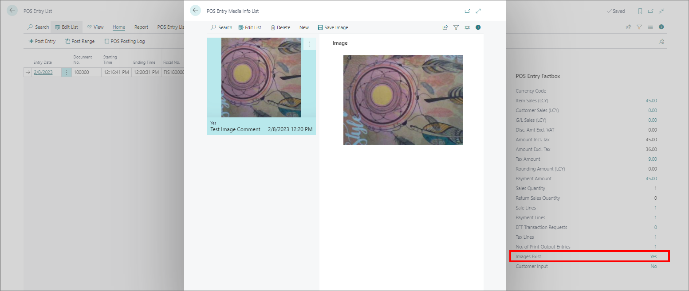

# Take photo on POS

The **Take Photo** feature can be enabled on POS units, and give an option to cashiers to take photos of products that customers have returned to stores. This action can be added in a form of a button in any POS menu and used during active POS sales. To use this feature, follow the provided steps:

## Prerequisites

- Add the **Take Photo** [button to the POS menu](add_button_to_pos_menu.md) you want it to be displayed in.       
  The action you need to attach to the button is **TAKE_PHOTO**.

### Procedure

1. Click **POS** in the Role Center's ribbon, followed by **Open POS**.     
   The POS login screen is displayed.
2. Enter the **Salesperson Code** in the provided field to log in.
   The button to which the **TAKE_PHOTO** action is attached can be found in the menu you've previously placed it in.
3. Click the **TAKE_PHOTO** button.    
   The **Take a picture** popup window from the integrated camera is displayed.    
4. Snap the picture, and click **Use** to upload it and connect it to the active POS sale if you're satisfied with the result. If not, you can **Retake** it.      
   The image is linked to the transaction posted in the **POS Entries** administrative section in Business Central.
5. To access the posted images, navigate to the **POS Entry List** from the Business Center's Role Center. 
6. Click **Yes** next to the **Images Exist** line in the **POS Entry Factbox** to access all images taken with the feature.     
   The **POS Entry Media Info List** window is displayed. In it, you can add comments, download the photos or take new ones.

    
