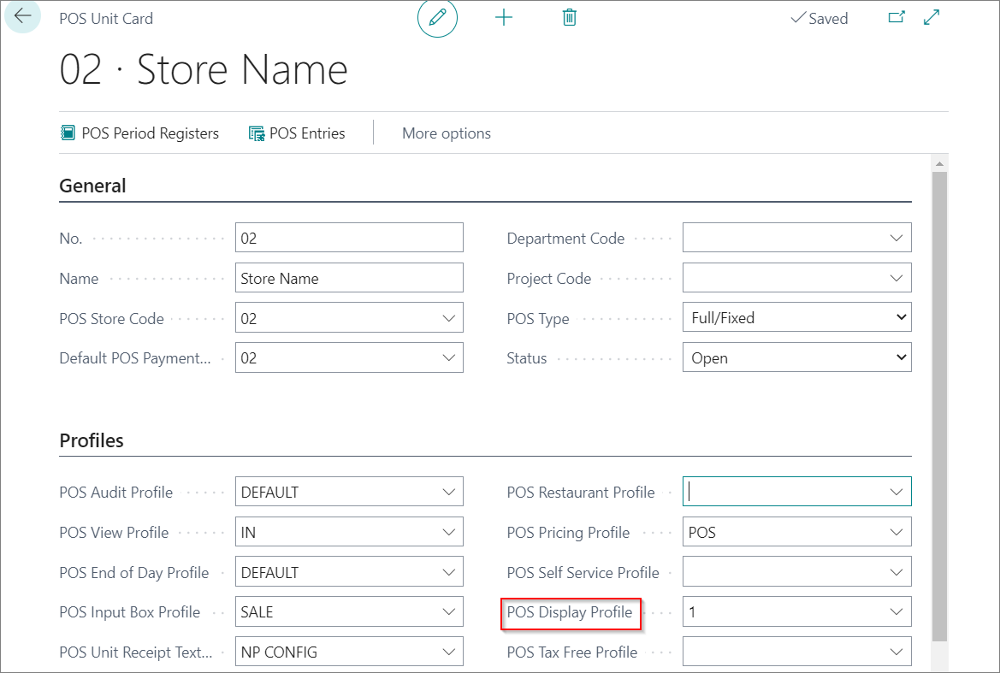

# POS Display Profile (reference guide)

Each POS unit can have a different display view. The following fields can be set up in each **POS Display Profile**:

| Field Name      | Description |
| ----------- | ----------- |
| **Code**       | Specifies the unique code of the profile.     |
| **Description**   | Specifies the short description of a profile.        |
| **Activate**  |  Activate the POS Display Profile on the customer display. |
| **Price ex. VAT** | Specifies whether the prices are visible without the VAT on the POS. |
| **Image Rotation Interval** |  Specifies the time-delay between the images (the number of milliseconds during which an image is displayed). |
| **Media Downloaded** | Specifies whether the media from **Display Content Code** should be downloaded. If checked, the POS won't download any media when loaded, and it will not check whether the local cache contains the images in the **Display Content Code** group. Instead, it will download and replace all, or do nothing. When adding new media to the **Display Content Code**, you need to deactivate this field to see the new media.|
| **Custom Display Codeunit** |  Specifies the customized codeunit used for out-of-the-box functionality. Adding a Codeunit ID here will expand on the base functionality and/or set the usage or limitations that could override the existing fields. If using a **Custom Display Codeunit**, read the documentation on that Codeunit. |
| **Display Content Code** | Specifies the **Display Content Code** group that will be used for this POS Display Profile. Display Content Codes are groupings of either images, videos, or URLs. This is where the media displayed on the customer display is uploaded or linked to. |
| **Screen No.** | Specifies the Windows display number that will be used. *0* is default, and will auto-select a non-main display. It is recommended to leave it on *0* unless the POS unit has more than 2 screens. |
| **Hide Receipt** | Remove the receipt from the customer display. |
| **Receipt Duration** | Specifies the number of milliseconds during which an receipt remains on-screen. |
| **Receipt Width** | Specifies the width of the whole receipt on the Customer Display. |
| **Receipt Placement** | Specifies the alignment of the receipt on the screen. It can be **Right**, **Left**, and **Center**. |
| **Receipt Description Padding** | Specifies the size of the field containing the **Sales Line Description**. |
| **Receipt Total Padding** | Specifies the size of the fields that contain the **Sales Line Totals** (i.e. Quantity x Unit Price). |
| **Receipt Grand Total Padding** |  Specifies the size of the field that contains the total for the entire sale. |

Once the POS Display Profile is defined, you can set it on the POS unit of your choice by adding the predefined POS Display Profile in the **POS Display Profile** field.

